> So we went through another year, didn't we?

---

春去冬来，又一年。是麻木的一年，仅存的记忆也在逐渐消褪，所以最好还是先把它记录下来。

似乎很难从时间线上梳理出什么有意思的事，于是乎还是先从「交际关系」开始。

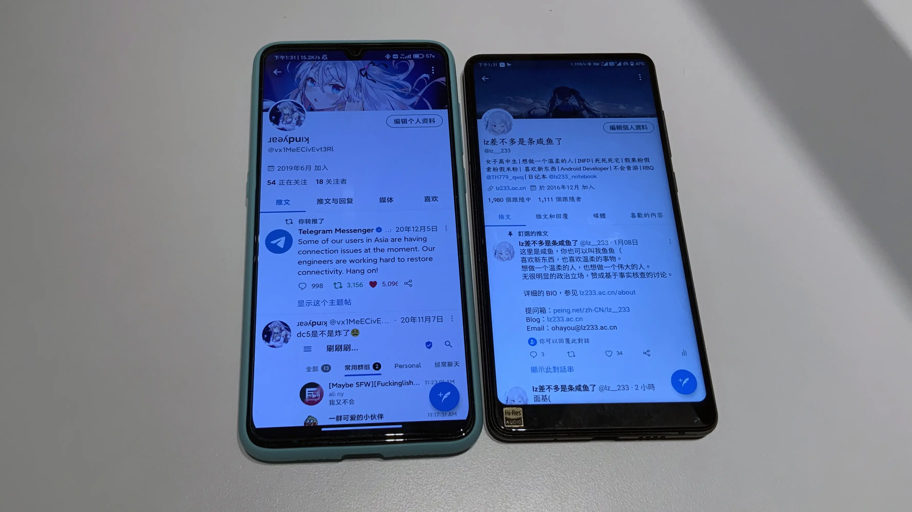

寒假，面了 kindyear。或许因出于「发现新人格」的缘故，整个世界确实开始有所转变了。

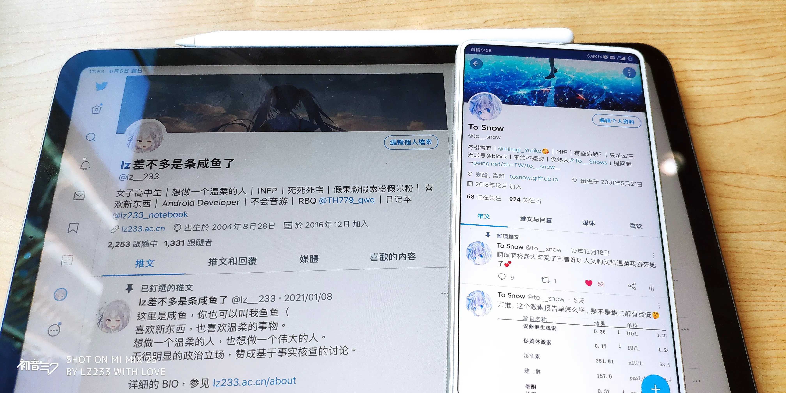

高考假期，面了雪舞姐，同时领略了南京的些许风光。是这一年里最放松的时段了，大概。

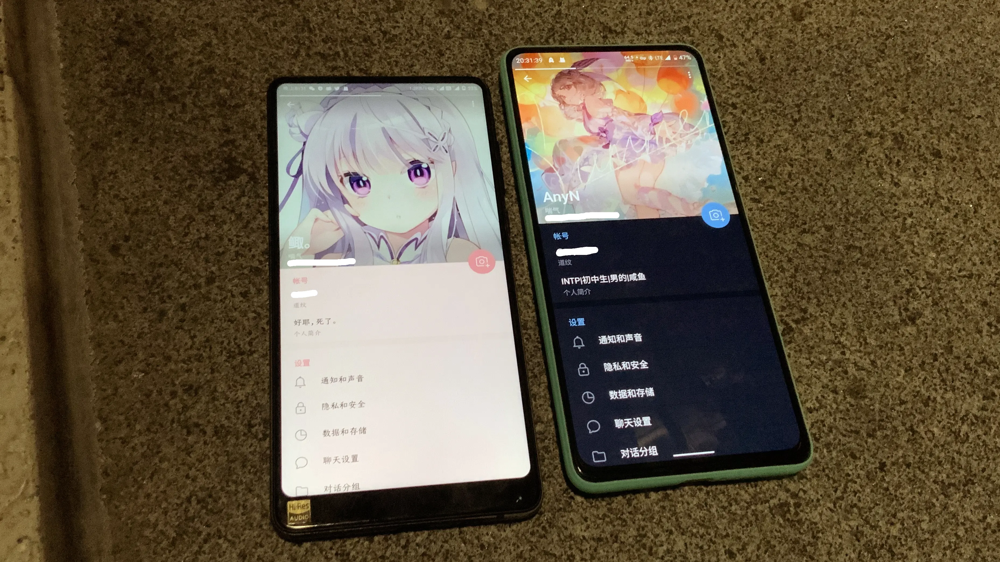

然后是暑假，趁着去医院的机会首先面了 anyN。

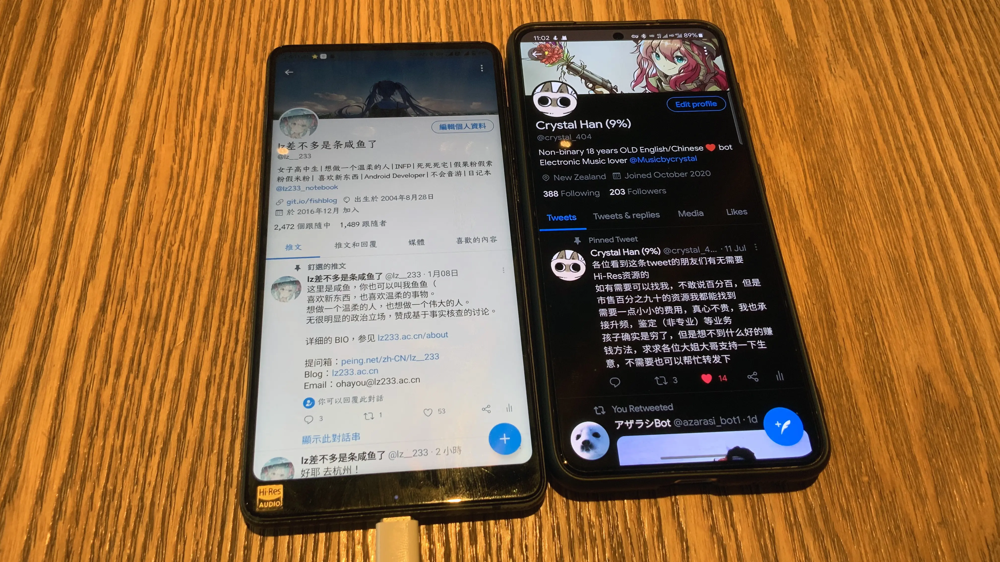

然后是面了镜子。很可爱，很开朗，喜欢。

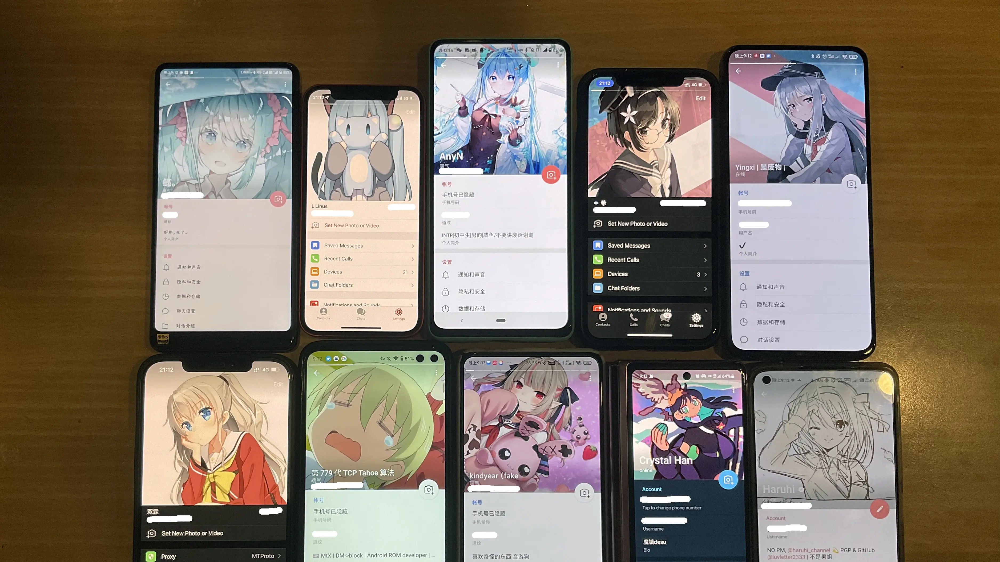

接下是 China Joy，面了很多人，也在尝试逐渐构建属于自己的「人际关系」。或许不很擅长，也可能很难，但依然必须经历，暂且这么想着。

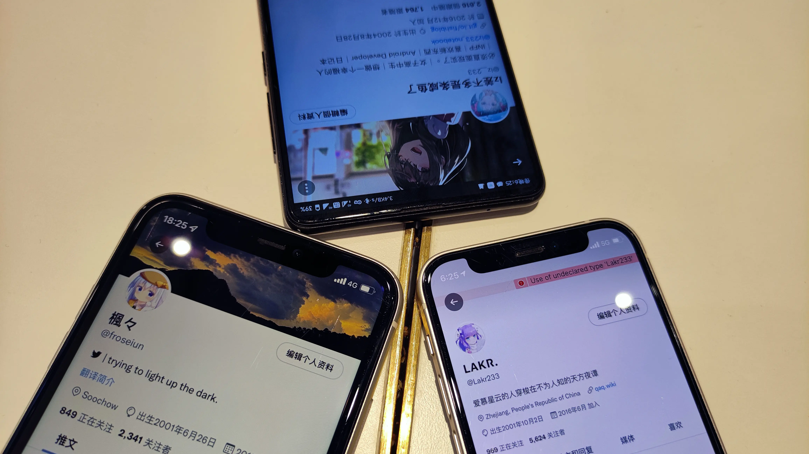

中秋假期，面了~~熊熊~~和 Lakr。大概是一类人，总归算是能找到了归属感。

和上一年不同了，伴随交际圈逐渐演变与交汇，自认为的性格略转向「外向」。遇见了更多志同道合的伙伴，但也与另一些独特的灵魂渐行渐远。领略了多样的人格与眼界之后，似乎亦可稍加明确自我追寻的远方究于何处。

总之，与挚友度过的时光总是快乐的。往后的日子也请务必能相伴而行呀！

---

这一年，与大家在一起之时也游历了许多地方，但大都集中于杭申。如果有机会，很想去更远的地方看看不同的世界。

小城市的高铁站，双向二站台。似乎一切需从这里开始。

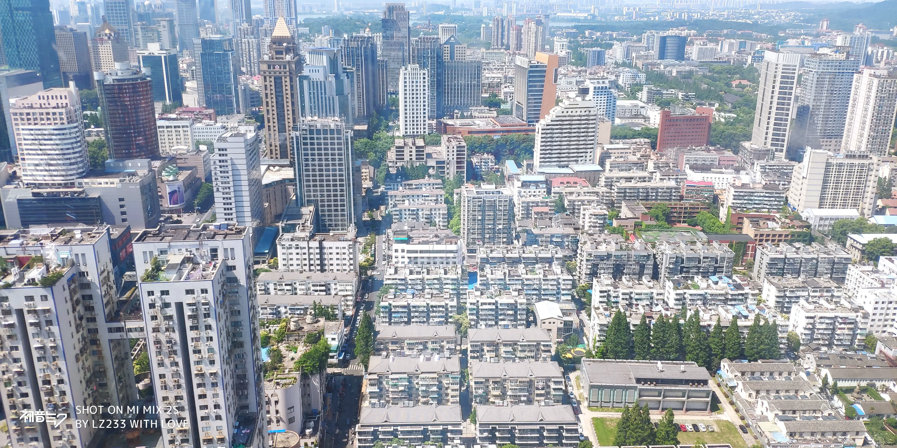

新街口附近街景。在这里大概能看到南京之繁华。

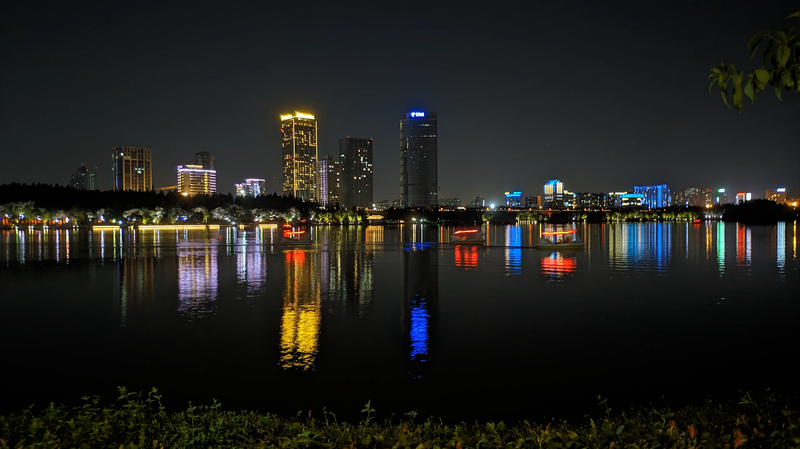

夜景。是和雪舞姐在一起时候记录下的。

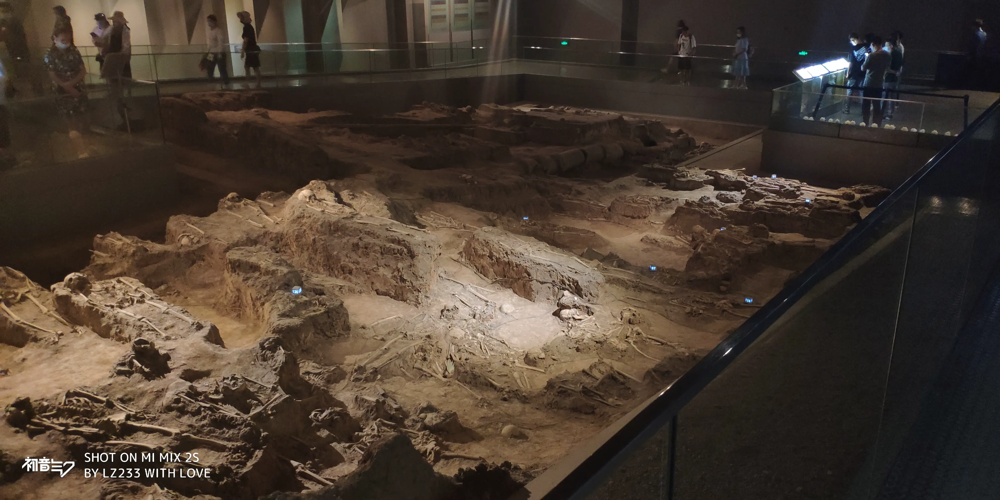

南京大屠杀遇难者纪念馆，在此一并入手两书。或许每个人都可以有自我对历史事件的观点，但请务必保留**知情权**。

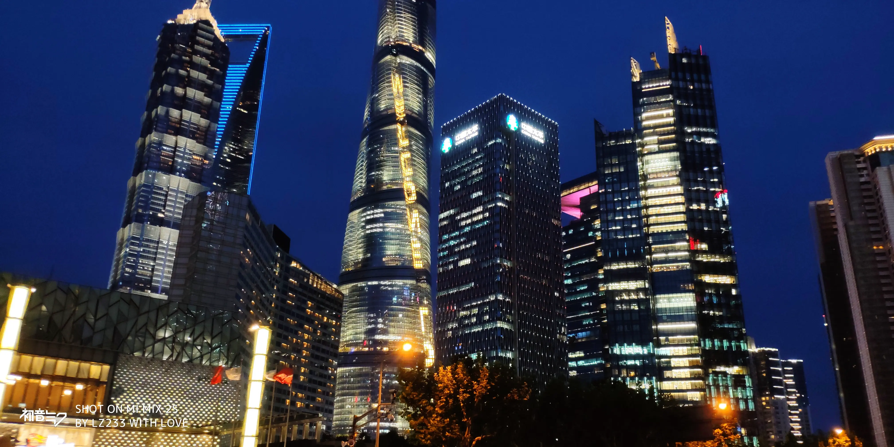

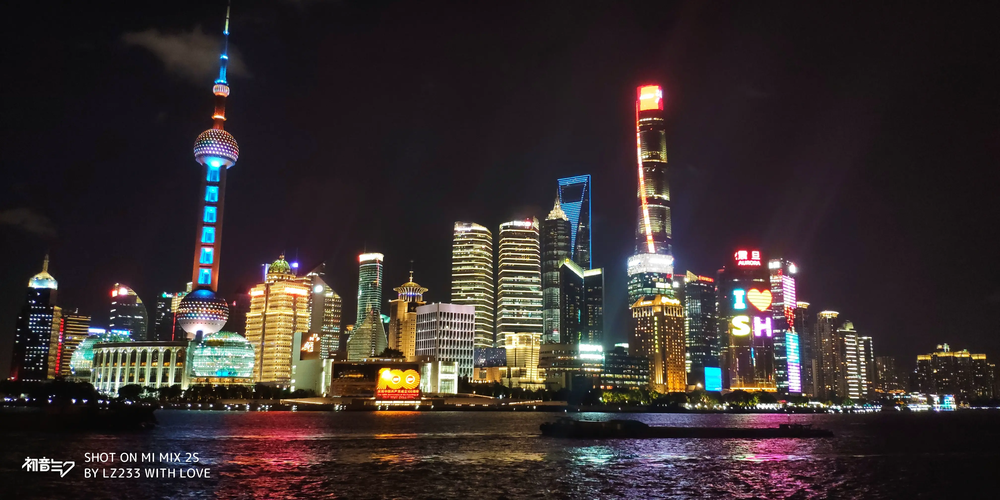

在申看病那天傍晚匆匆路过外滩与陆家嘴，算是对 MIX 2S 夜景比较好的~~诠释~~。

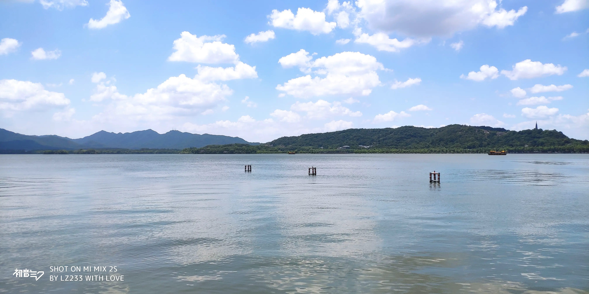

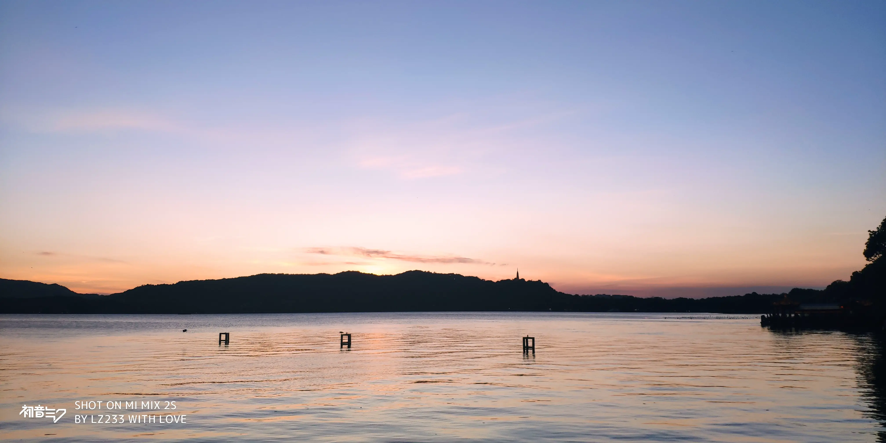

与镜子在一起时的西湖。那天天气很棒，还记得。

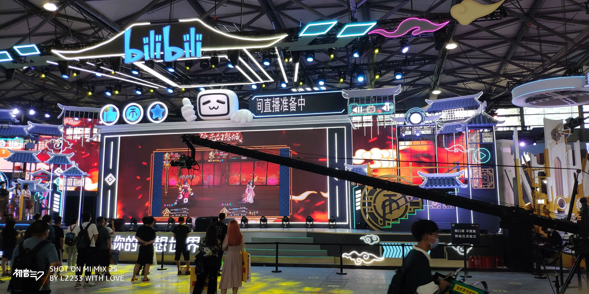

China Joy 现场。也是镜子陪着我，感谢。

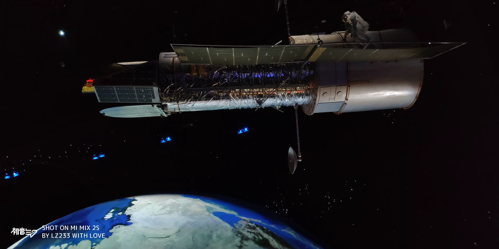

上海天文馆。总是能引起人无限遐想的天文馆。

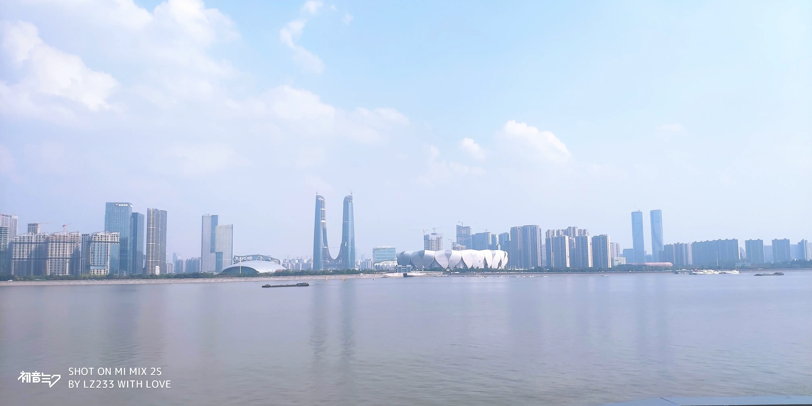

城市阳台。很美妙，而更棒的是有你陪伴，和你的故事。

还有一年不到的日子就会离开长三角了吧，对未来的目的地怀有期待。

---

可能是学业原因，一年下来并没有积累很多技能点，除了 Kotlin 的更加熟练和 Android 开发模式的熟练外。
尝试维护了更多的项目，如 [Cloud Music For Gravity](https://gravity.project.ac.cn/application.html#netease-cloud-music-for-gravity) 和 [project.ac.cn](https://project.ac.cn)。也尝试使用了 MVVM、Kotlin Coroutine 和 LiveData。
其实还有更多的想法藏于心中，但大概都因能力和机遇的缺乏，无法得以实现。
明年就告别高中时代了，希望会有更多的收获。

---

与世界同行是安逸，与世界逆行是理想。所以无需跟随主流了。

做自己吧。
