这篇文章适合不在香港生活，不了解这段历史，但对香港铁路感兴趣，想对其有总体认知的读者阅读。

在阅读时建议同时绘制自己的线路草图，这有助于对香港铁路产生更深的理解。

---

- `山顶缆车` 1885 年 9 月，山顶缆车正式动工。

- `山顶缆车` 1888 年，山顶缆车工程竣工，5 月 28 日进行试车，5 月 30 日上午 8 时正式投入服务。

- `有轨电车` 1903 年，有轨电车两段单轨铺设工程正式展开。

- `有轨电车` 1904 年 7 月 30 日上午 10 时，香港电车正式开通。

  ---

- `九广铁路` 1906 年，九广铁路英段展开兴建工程。

- `九广铁路` 1909 年 5 月 17 日，烟墩山铁路隧道正式贯通。隧道建筑工程于 1910 年 2 月 16 日顺利竣工。

- `九广铁路` 1910 年 10 月 1 日，九广铁路竣工并举行开幕典礼，当天下午 3 时在尖沙咀举行通车仪式。火车的正常服务则于 10 月 2 日正式开展。同年 11 月 11 日，大埔墟旗站改为正式车站。

  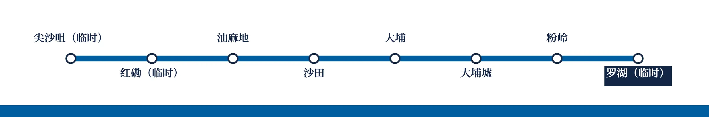

- `九广铁路` 1911 年 10 月 5 日，广九直通车正式通车，拆除罗湖临时站。10 月 8 日，广九铁路华段全线通车。

  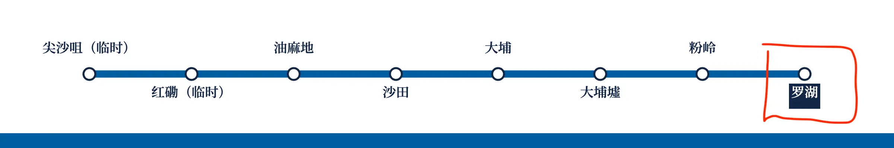

- `九广铁路` 1911 年 12 月 21 日，连接粉岭至石涌凹一段的粉岭支线顺利完成并开通。1912 年 4 月 1 日，延伸至沙头角路段。

  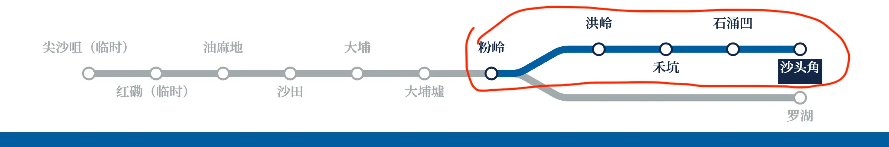

- `九广铁路` 1913 年，具有独特建筑风格的大埔墟车站落成启用。在上水设上车点。

  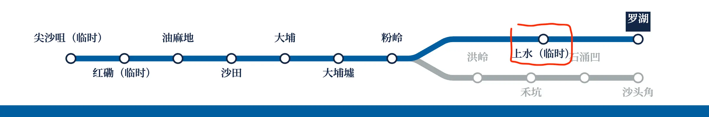

- `九广铁路` 1916 年 3 月28 日，九龙总站（尖沙咀）正式启用。唯车站站台率先在 1914 年 4 月投入服务。

- `九广铁路` 1921 年，何文田增设上车点。同年 9 月 15 日，原红磡站作为客运站停用，发展为编组站、调度场及修车厂。

  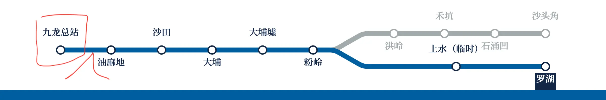

- `九广铁路` 1928 年 4 月 1 日，粉岭支线正式停办。

  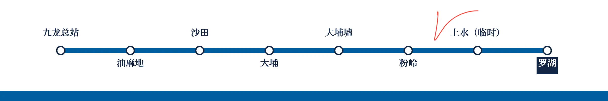

- `九广铁路` 1930 年 5 月 16 日，增设上水车站。然上水车站为后期增设，为避免影响主线运作，未铺设额外侧线，亦只设有单轨侧式月台。

  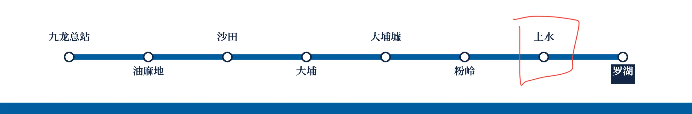

  *（抗日战争和国共内战导致服务中断、铁路损毁，略过。）*

- `九广铁路` 1950 年 9 月 11 日，和合石支线投入服务。

  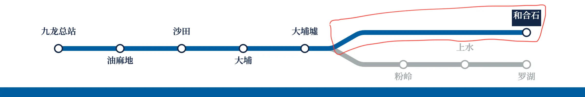

- `九广铁路` 1955 年，首两辆柴油内燃机车抵港。同年 9 月 2 日，正式投入服务。

- `九广铁路` 1956 年 9 月 24 日，马料水站开通。

  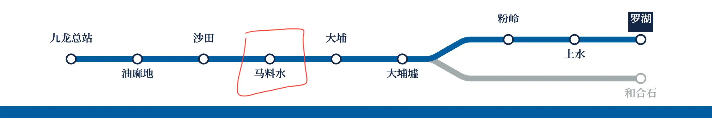

- `九广铁路` 1965 年元旦，大埔站改称大埔滘站。

  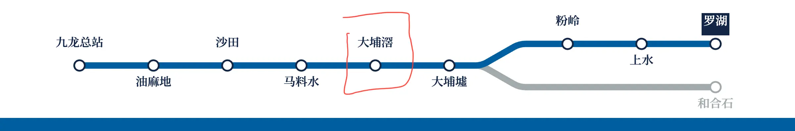

- `九广铁路` 1966 年 12 月 11 日，马料水站宣布改名大学站，以配合香港中文大学成立。1967 年 1 月 1 日，正式生效。

  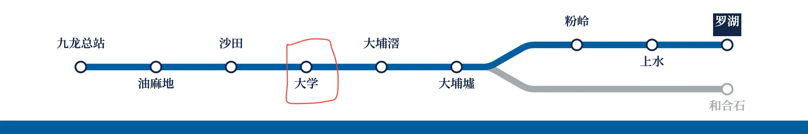

- `九广铁路` 1969 年 1 月 1 日，油麻地站改称旺角站。

  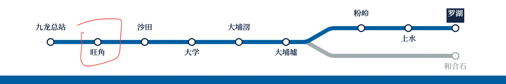

- `九广铁路` 1968 年，九铁车场由红磡迁往火炭的何东楼。

- `九广铁路` 1973 年，九广铁路英段展开双轨化工程。

  ---

- `地下铁路` 1975 年初，集体运输临时管理局宣布「地下铁路修正早期系统」。

- `地下铁路` 1975 年 9 月 26 日，成立地下铁路公司以取代集体运输临时管理局。

- `九广铁路` 1975 年 11 月 30 日，红磡新火车总站启用，九龙总站由尖沙咀旁迁至红磡湾。

  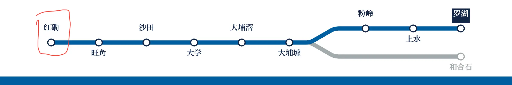

- `九广铁路` 1978 年，九广铁路开始了全线现代化及电气化计划。

- `九广铁路` 1978 年 6 月 7 日，九龙总站被拆卸，仅保留钟楼。

- `九广铁路` 1978 年 9 月，马场支线建成，并设马场站，以配合 10 月 7 日开幕的沙田马场。

  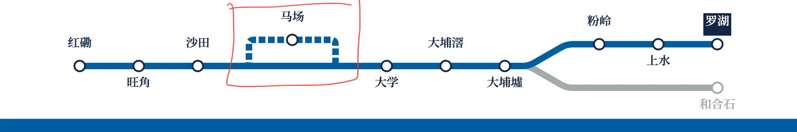

- `修正早期系统` 1979 年 9 月 30 日，地下铁路石硖尾至观塘一段率先竣工，举行通车开放日。

  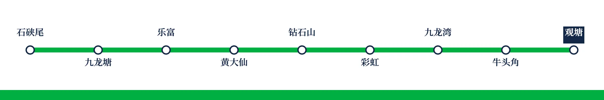

- `修正早期系统` 1979 年 12 月 16 日，地下铁路延伸至尖沙咀，然亚旺角及油麻地延迟至 12 月 31 日及 12 月 22 日才开放使用。

  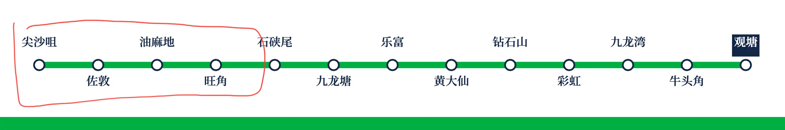

- `地下铁路` 1980 年春季，地下铁路首个车厂上盖项目德福花园陆续建成及入伙。

- `修正早期系统` 1980 年 2 月 12 日，「修正早期系统」南段的尖沙咀至中环通车。

  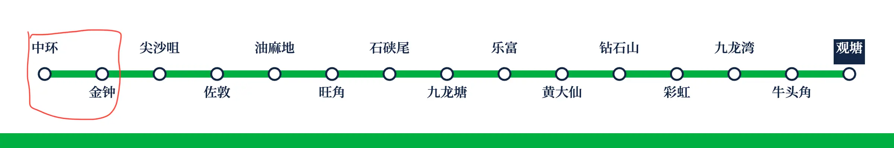

- `九广铁路` 1980 年 4 月 23 日，毕架山铁路隧道正式贯通。1981 年 4 月 24 日，烟墩山隧道停用。同年 4 月 27 日，毕架山隧道正式启用通车。

- `九广铁路` 1981 年 4 月至 1982 年间，九广铁路全新电气化列车陆续抵港，分为市区型和市郊型两种。

- `九广铁路` 1982 年 5 月 2 日，大埔滘站停用。

- `九广铁路` 1982 年 5 月 4 日，九龙塘站启用，作为与地下铁路的转乘车站。

  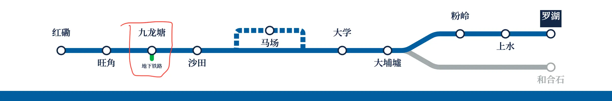

- `荃湾线` `观塘线` 1982 年 5 月 10 日，荃湾线通车，并率先开放荃湾至荔景沿线车站，其余车站在同年 5 月 17 日开放，并取代「修正早期系统」直达中环。「修正早期系统」余下路段改名为观塘线。

  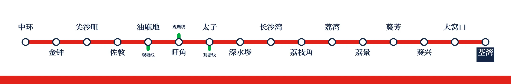

  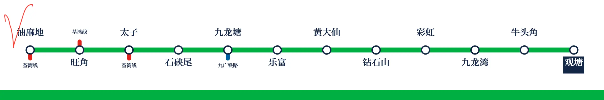

- `九广铁路` 1982 年 12 月 24 日，通过《九广铁路公司条例》，九广铁路公司正式成立，九广铁路从公营部门转为公营公司。

- `九广铁路` 1983 年 4 月 7 日，新修建的运头角大埔墟车站启用。旧大埔墟车站以香港铁路博物馆名义于 1986 年 12 月 21 日起开放参观。

  

- `九广铁路` 1983 年 4 月 10 日，和合石支线关闭。

  

- `九广铁路` 1983 年 7 月 15 日，九广铁路双轨电气化工程全线完工。最后一班柴油客车于 7 月 23 日提供服务。

- `九广铁路` 1983 年 8 月 15 日，临时大围车站启用。

  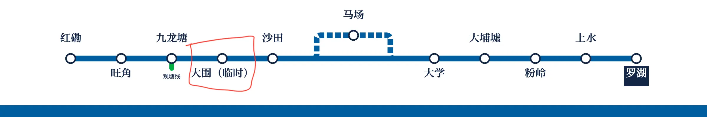

- `九广铁路` 1985 年 2 月 15 日，火炭站启用。

  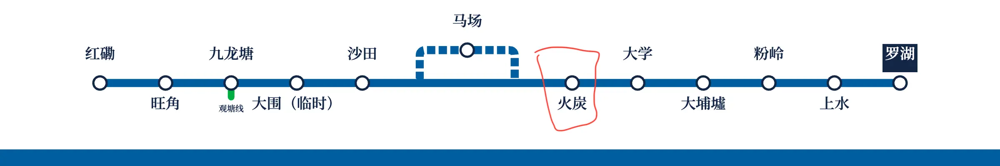

- `港岛线` 1985 年 5 月 31 日，地下铁路港岛线的金钟至柴湾段正式通车。油麻地站英文名 Waterloo Station 改名为 Yau Ma Tei Station，旺角站英文名 Argyle Station 改名为 Mong Kok Station，荔湾站改名为美孚站。上环至金钟段则延至 1986 年 5 月 23 日才启用。

  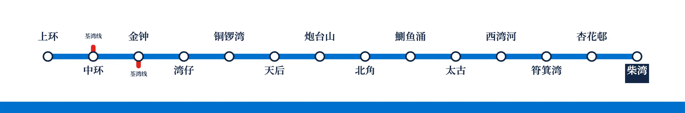

  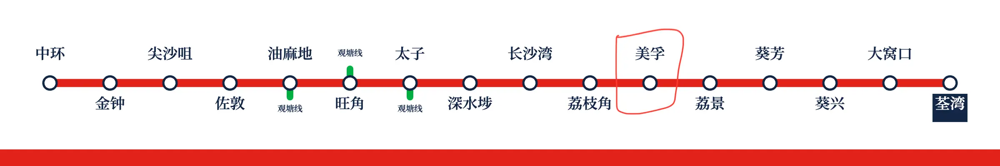

  ---

- `轻便铁路` 1985 年 7 月 14 日，轻便铁路系统正式动工。

- `九广铁路` 1986 年 4 月 23 日，大围永久车站工程竣工启用。

  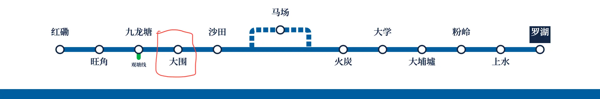

- `九广铁路` 1987 年 1 月 16 日，新罗湖站投入服务。

- `轻便铁路` 1988 年 9 月 8 日，轻便铁路启用。

- `九广铁路` 1989 年 5 月 9 日，太和站启用。

  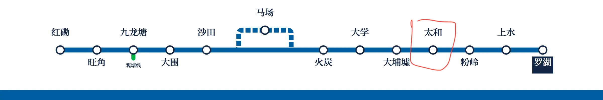

- `观塘线` 1989 年 8 月 6 日，观塘线列车改为鰂鱼涌站作为终点站。蓝田站亦在 8 月 9 日启用。

  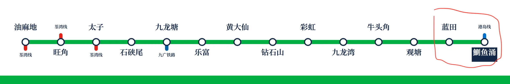

- `轻便铁路` 1989 年 11 月，屯门支线动工，1992 年 2 月 2 日全线通车。
  
- `轻便铁路` 1989 年 11 月 5 日，天水围支线动工，1993 年 1 月 10 日通车，第三段路线扩充计划则于 1995 年 3 月 26 日通车。
  
- `九广铁路` 1991 年 2 月至 12 月，九广铁路为近郊电气化列车进行通勤化改造，包括减少座位及拆除洗手间。1996 年，九广铁路进一步为电气化列车进行中期翻新工程，并于 1999 年秋季完成。
  
- `机场快线` 1994 年 11 月，地下铁路公司陆续批出兴建机场快线工程合约。
  
- `八达通` 1997 年，联俊达有限公司推出八达通，并于 1997 年 5 月率先在地下铁路试用。
  
- `地下铁路` 1998 年 8 月，地下铁路开始将所有英制列车进行翻新工程，翻新后的列车均被称为「现代化列车」（M-Train）。

- `东涌线` 1998 年 6 月 21 日，机场铁路东涌线举行开幕仪式，并于翌日开通运营。

  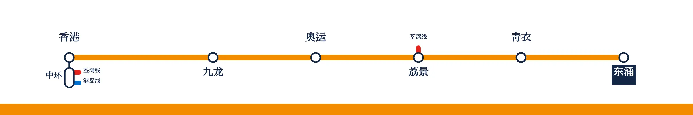

- `机场快线` 1998 年 7 月 6 日，机场快线随香港国际机场同时投入服务。

  

- `九广西铁` 1998 年 10 月 26 日，九广铁路公司正式动工建造西部走廊铁路近郊客运线。

- `将军澳线` 1999 年 4 月 24 日，将军澳支线正式动工兴建。

- `地铁` 2000 年 4 月 26 日，地下铁路公司注册成为有限公司，更名为地铁有限公司。

- `马鞍山铁路` 2001 年 2 月 12 日，马鞍山铁路正式动工。

- `九广东铁` 2001 年 4 月，尖沙咀支线正式动工。

- `观塘线` 2001 年 9 月 27 日，属于将军澳支线一部分的鰂鱼涌至北角段提早开通，并属于观塘线运营，以舒缓鰂鱼涌转车拥挤的问题。

  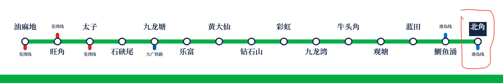

- `八达通` 2002 年，联俊达有限公司改名八达通卡有限公司。

- `将军澳线` `观塘线` 2002 年 8 月 4 日，观塘线油塘站率先启用，将军澳支线正名为将军澳线，并试行于油塘至北角之间。

  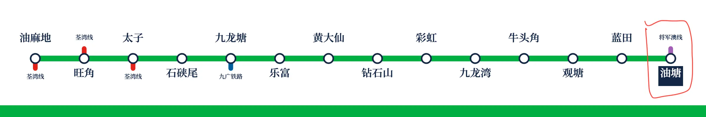

  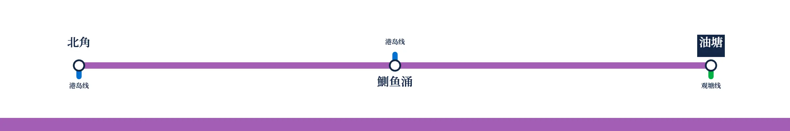

- `将军澳线` `观塘线`  2002 年 8 月 18 日，将军澳线全线正式通车，调景岭作为观塘线的终点站。

  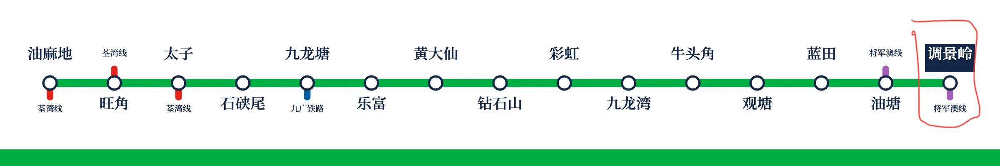

  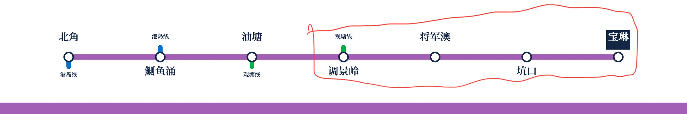

- `九广东铁` 2003 年 1 月 29 日，落马洲支线工程展开。

- `东涌线` 2003 年 6 月 2 日，东涌线南昌站完工，最后于 12 月 16 日随九广西铁全线通车而正式启用。

  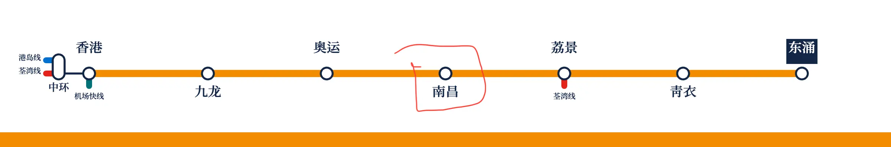

- `九广西铁` 2003 年 12 月 20 日，西铁工程竣工。

  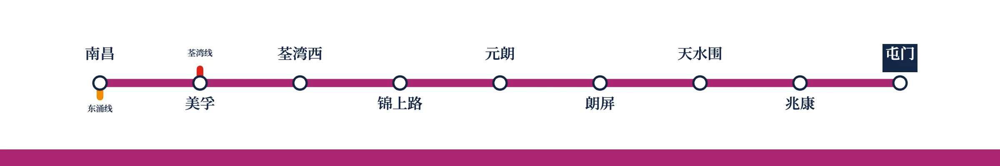

---

- `昂坪 360` 2004 年 2 月，昂坪 360 的建筑工程展开。

- `九广东铁` 2004 年 10 月 24 日，尖沙咀支线竣工启用。

  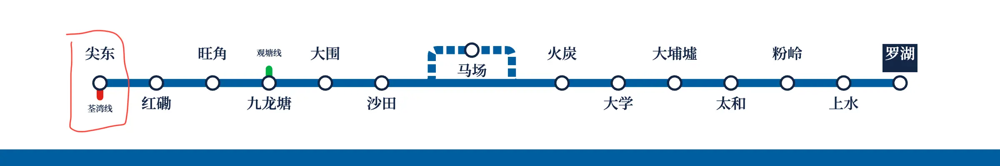

- `马鞍山铁路` 2004 年 12 月 21 日，马鞍山铁路落成通车。

  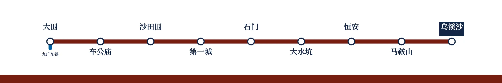

- `迪士尼线` `东涌线` 2005 年 8 月 1 日，竹篙湾铁路正式通车，并改名为「迪士尼线」。

  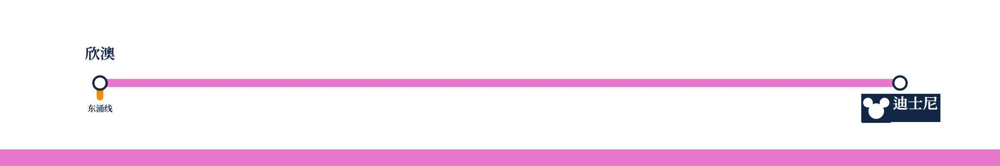

  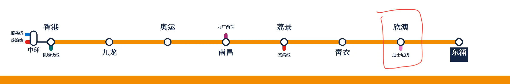

- `九广西铁` 2005 年 11 月 8 日，九龙南线正式动工。

- `机场快线` 2005 年 12 月 10 日，博览馆站随亚洲国际博览馆揭幕而正式启用。

  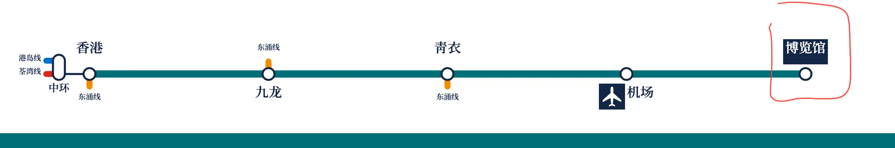

- `昂坪 360` 2006 年 9 月 18 日，昂坪 360 正式启用。

- `九广东铁` 2006 年底，落马洲支线竣工，但延后至 2007 年 8 月 15 日下午 4 时正式启用。

  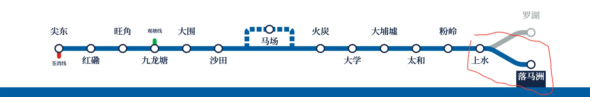

- `港铁` 2007 年 12 月 2 日，随着《两铁合并条例》正式生效，九广和地铁系统正式合并运营。

  - 地铁有限公司的中文名更改为「香港铁路有限公司」。
  - 有关线路运营权归港铁所有，而拥有权仍属于九铁公司。
  - 九广东铁、九广西铁、马鞍山铁路分别易名为东铁线、西铁线和马鞍山线。
  - 西铁旺角站改名为旺角东站。

- `港岛线` 2009 年 8 月 10 日，西港岛线项目正式动工。

- `西铁线` `东铁线` 2009 年 8 月 16 日，九龙南线正式通车。

  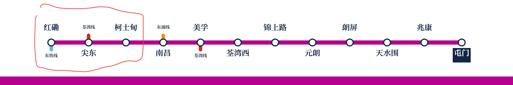

  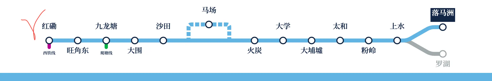

- `高速铁路` 2010 年 4 月，广深港高速铁路香港段正式动工。

- `南港岛线` 2011 年 5 月 18 日，南港岛线（东段）工程得以进行。

- `观塘线` 2011 年 7 月 25 日，观塘线延线工程动工。

- `港岛线`2014 年 12 月 28 日，西港岛线项目落成启用。西营盘站则在 2015 年 3 月 29 日启用。

  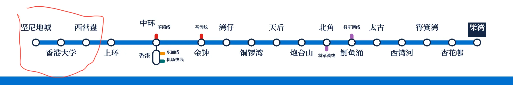

- `观塘线` 2016 年 10 月 23 日，观塘线延线通车。

  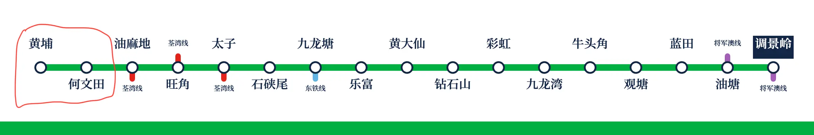

- `南港岛线` 2016 年 12 月 28 日，南港岛线（东段）正式通车。

  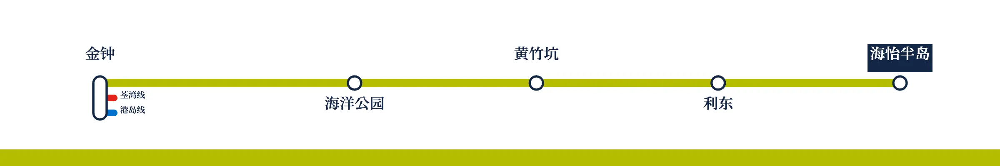

- `高速铁路` 2018 年 9 月 23 日，广深港高速铁路香港段铁路正式通车。

  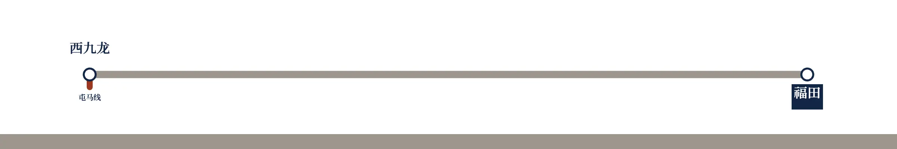

- `屯马线` 2020 年 2 月 14 日，屯马线一期（大围至启德）通车。

  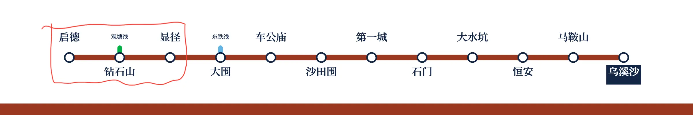

- `屯马线` 2021 年 6 月 27 日，屯马线二期（启德至红磡）通车，与西铁线合并为屯马线，西铁线的线路颜色让位给北环线。

  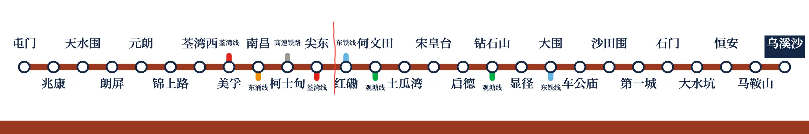

- `东铁线` 2022 年 5 月 15 日，东铁线过海段正式通车。

  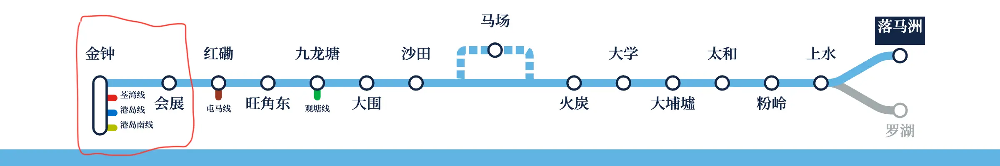
