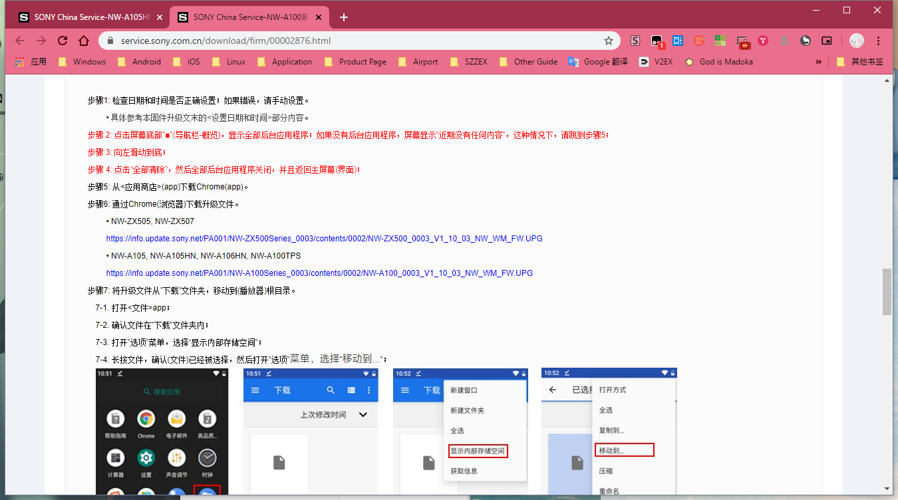
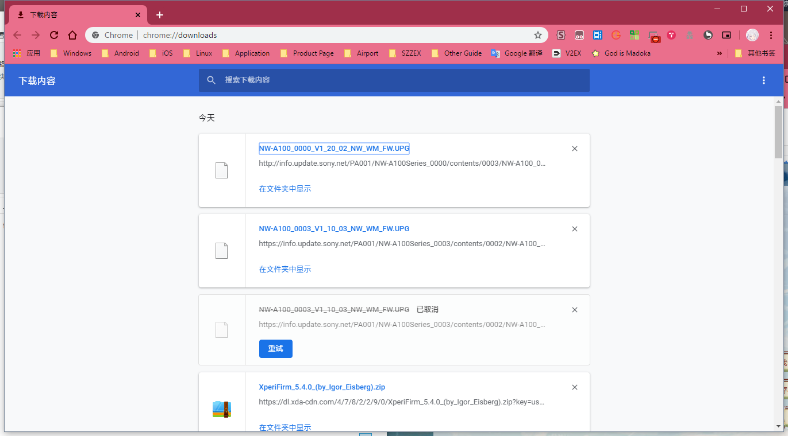
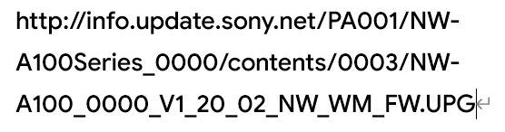
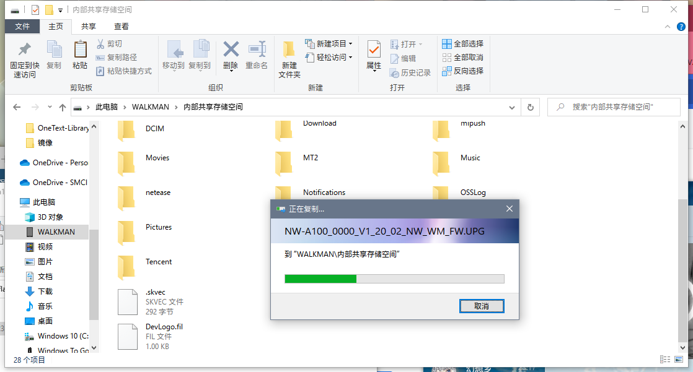
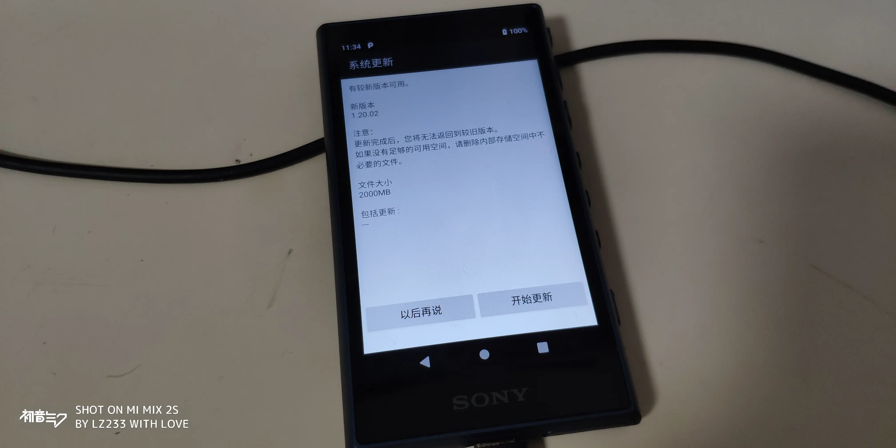
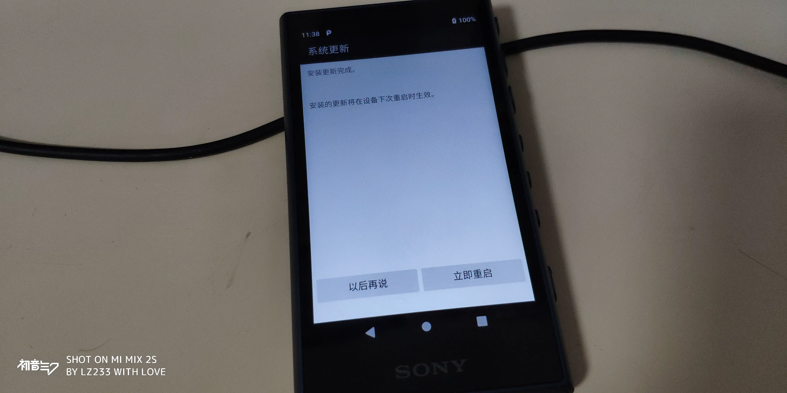
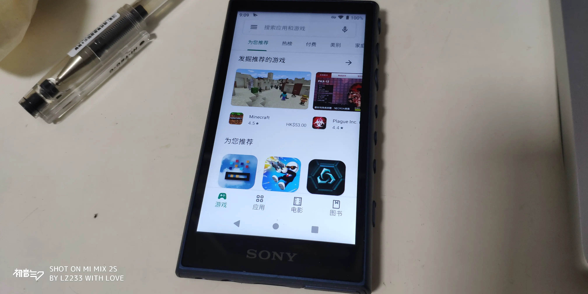
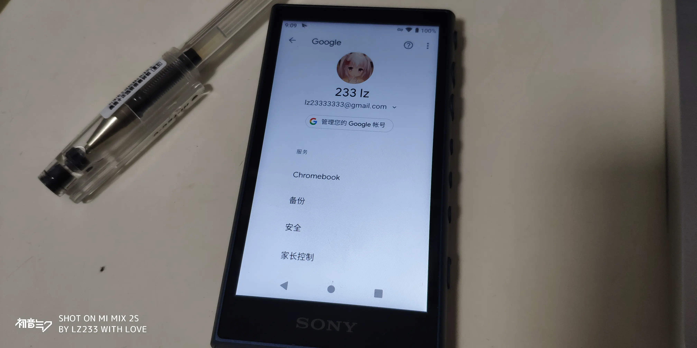
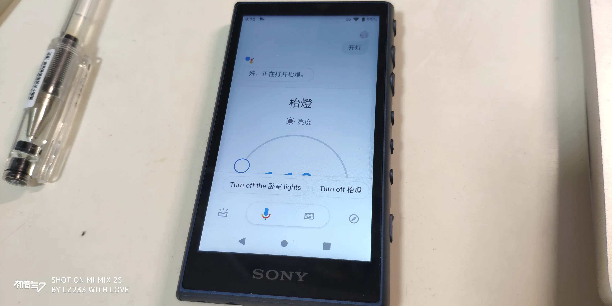
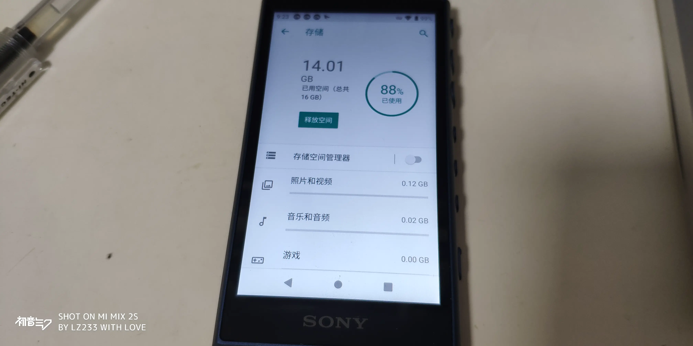

前言：本来这块黑砖只是个播放器，本应该做好它的本职工作。但众所周知，由于一只蝙蝠，再加上国行的设备不自带 Google 全家桶，所以我开始打起了我心里的小念头。

---

- Part1 刷机

要想将刷入日版固件，首先我就想到了在 XDA 里搜搜（

果然没有。但是我们可以在 SONY 中国官网找到这么一个链接。↓

根据以往的经验，003 指的就是地区，那么 000 就是日版。contents 后面的东西我也不知道是啥，自己随便瞎凑几个。通过 Google 搜寻到当前设备的最新版本是 1.20.02，那么将这些数据替换试试？

果然可以。那么最后的链接就如下图所示。↓

下载完成后，直接将固件拖入设备根文件夹，然后记得**断网**进入升级程式。（一定要断网，不然检测不到）

安装后重启即可。放心，不会变成真黑砖的（

---

- Part2 体验

首先，日版固件支持简中，音质也无变化~~（不要和我说玄学提升）~~。

我刷日版固件的最大目的就是想用~~咕咕~~全家桶，以下是几张体验图。↓

新版本明显会省电，而且 SONY 那边还加了自动关机的功能~~（老年机标配）~~。我安装完之后储存空间不减反增，不知道是什么神奇操作。

需要稍微提一下的是，日版自带了全套~~咕咕~~全家桶，包括 Gmail 等与音乐无关的应用，不需要的可以直接停用。

---

- Part3 总结

在上一篇文章里我说过，我是把他当作播放器来看待的，可终究还是忍不住我自己啊.webp。

虽然这台设备的系统是从 AOSP 直接改过来的，但是某厂商真的没有给这台设备加任何一个多余的功能。关于内存，我有一个朋友告诉我这玩意是内存大户，起码我自己没感觉，大家自己感受下吧。

---

- ## Part4 注意事项

**千万**

**不要**

**在后续**

**用系统自带的在线更新**

**和 Music Center 的更新**

**否则会**

**重新变成**

**国行固件（盲猜是通过序列号识别的）**

**请**

**按照上面的方法**

**重新**

**手动下载**

**新的固件**

**（悲 **

---

附 1.21 固件：https://info.update.sony.net/PA001/NW-A100Series_0000/contents/0004/NW-A100_0000_V1_21_00_NW_WM_FW.UPG