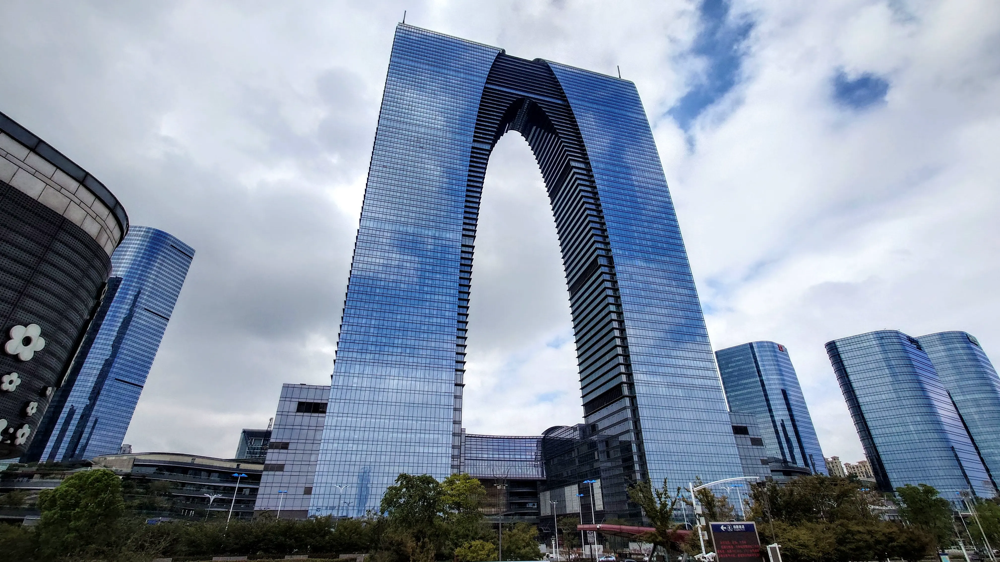
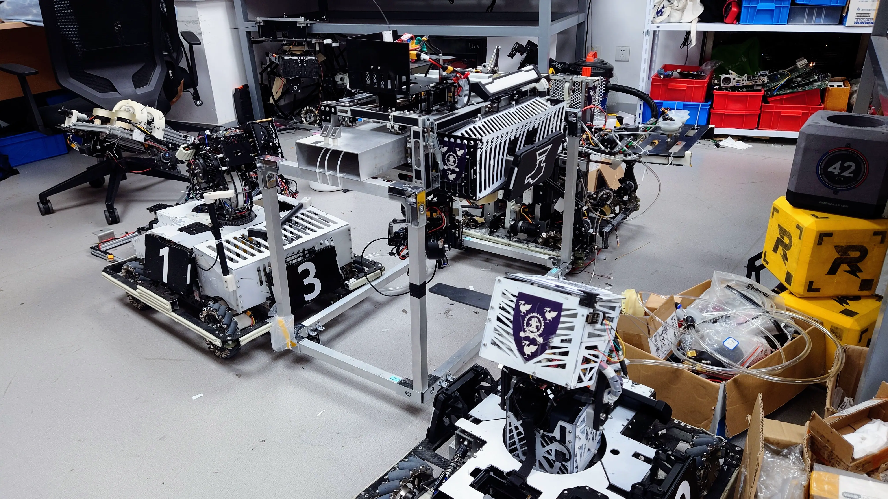

何妨趁这世界宽阔寂寥

自穹顶极光之下舞蹈

——<a href="https://music.163.com/song?id=447944103">《Destination》 • Kevinz</a>

---

*写这篇随笔呢，主要还是为了与自己达成和解，所以会非常意识流，先说抱歉。*

有很多想说的，却不知道如何去表达，只能先流水账似地回顾一下今年的事情。

高中时候的事就不愿再提了罢，在[记述](/2022/06/15/my-life-with-jiashan-senior-high-school/)了一些较为愉快的 point 之后，我选择保持沉默。高考的最后一门是地理，特意提前 10 分钟交卷，仅仅是想着「如果不这样做的话，就再也没机会了」。出了考场，将高中最后的记忆小心封存后，第一件事就是打开 Telegram，询问熊明日能否陪我走走，之后第二天就去了杭。

然后是散伙饭，和鸟，和砍砍，和炸鸡，填志愿，领材料，去威海，去烟台，飞沈阳，回浙江，领录取通知书，和砍砍、炸鸡还有光量子，见带鱼，去南京，飞重庆，陪熊逛嘉兴，陪砍砍炸鸡去沪见拾一，过成年的生日，在杭和砍砍、橘子。没了？没了。重点是开学之后的事。

心里的落差感是挺大的——说实话，选择这个学校最主要是为了能「一切从简、及格就够」，但也没顶住某人的加速度和更多的琐事。或许，应该说，自己本身也是体制内过来的，还想苛求有什么世外桃源吗。

大概一个人想去更远的地方的时候，才有一些动力——起码对我来说。苏州离家并不远，却一直没真正去过，也没从周围的消息来源中听过几次——小城市的人大约都不喜欢远方。总而言之，苏在我心中的印象一直不错。

谈到这个，可以继续延伸。来苏之后去了挺多地方，有了一些经历，由此也有了印象的转变。这里不差，但并不像心中所想之般美好。具体而言，喜欢它郊区的自然，但看不惯其滞后的城市建设和比浙江落后的行政管理。对苏州失去好奇心后，下一次的 destination 又在哪呢？需要继续编织「更远的远方」了。

转回来。这里的环境可能相对会更自由，但 DDL 焦虑似乎却更重了。为什么呢？和学业无关的琐事更多了，没有这个精力去处理。或许这就是成长吧，需要被迫去处理更加琐碎和多样的事务了。

然后开始真正为这一年画个句号。

这一年，体验过杭海城际，去过了洪崖洞，也和朋友们一起在山顶看过星星。旅记之类的流水账就不提了罢，以后也会主要放在 [travel.lz233.ac.cn](https://travel.lz233.ac.cn)。毕竟，除了路上的景和物，陪你在一起的人和这份经历本身才更加值得被爱，不是吗？可惜这些是言语不好表达的。

越发地感到，我不是一个「群体的人类」。和朋友们在一起时确实很开心，特别是和可爱的你们在一起。但是，友情，或者说，和周围人的联系，对于我来说似乎是一件很难维持的事情。为了跟上这种关系的变化，我不得不花费额外的、不情愿的精力去追随上。想过社交的目的究竟是什么，但很自私地，到底还是为「自己」服务吗。希望能在下一年**真正**减少无意义的、娱乐性质的社交。

另一点，自我感觉还是不敢成为心中想成为的那个人。同时地，也在远离之前的自己。最后到底会变成什么样呢，不知道啊。

今年完成了一些什么项目呢？开源社区方面，首先应该是 [Tarnhelm](https://tarnhelm.project.ac.cn)，于高考之后的暑假完成。其次，为学校做了一个[第三方客户端](https://github.com/lz233/yaxjtlu)，包含每天都会在学校用到的功能。还逆了点奇奇怪怪的小玩意，做了[按键映射](https://github.com/lz233/Calculator_AllWinnerA50)。

其他的一些，应该是加入了学校的 Team GMaster，备赛 [RoboMaster](https://www.robomaster.com)，尝试深入机器学习领域，算是兑现上一年的承诺。另外，还加入了 Sailoud，~~摸鱼 Android 开发~~。

谢谢你看到这里。这就是我今年的人生旅途了。同样长的时间跨度，大家又和这个世界发生过怎样的奇妙反应呢？

为你，也为我，向下一年许个愿吧：在自己感兴趣的领域继续深入，不要再继续审时度势这个世界了——用足够的能力去改写她。

新的一年也要坚强并快乐。

---

一点尾记：

- 为什么标题是「at」，而不是「in」？

  感觉「in」在这里就不是很合适，我不想突出「在这一年**当中**的旅程」，而是「旅程在这一年是这样发生的」。

- 为什么是「年鉴」，而不是「年度报告」？

  「报告」这类的体裁更像是写给大家看的，而「年鉴」是给自己看的，应该可以更加地激励自己吧。
