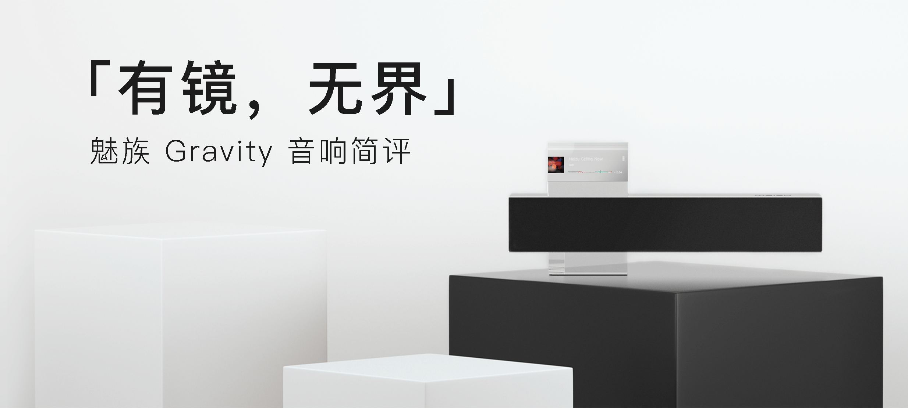
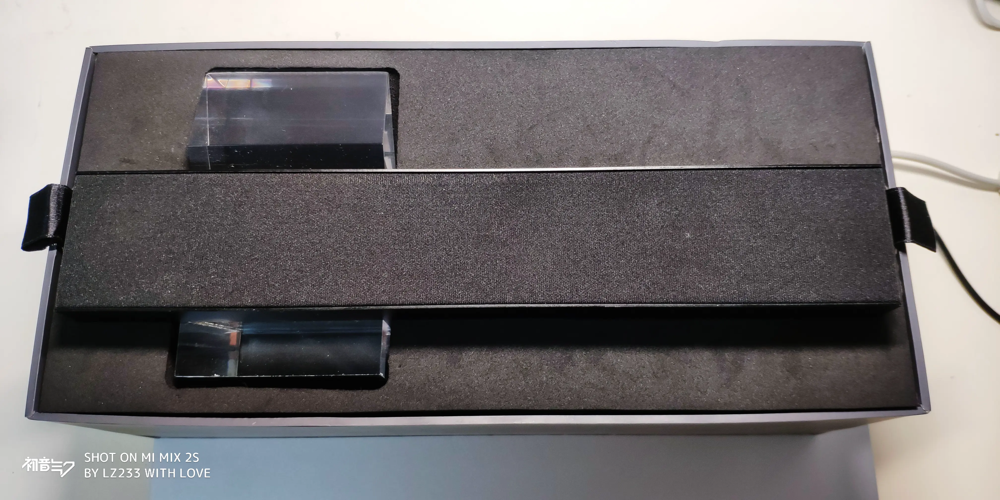
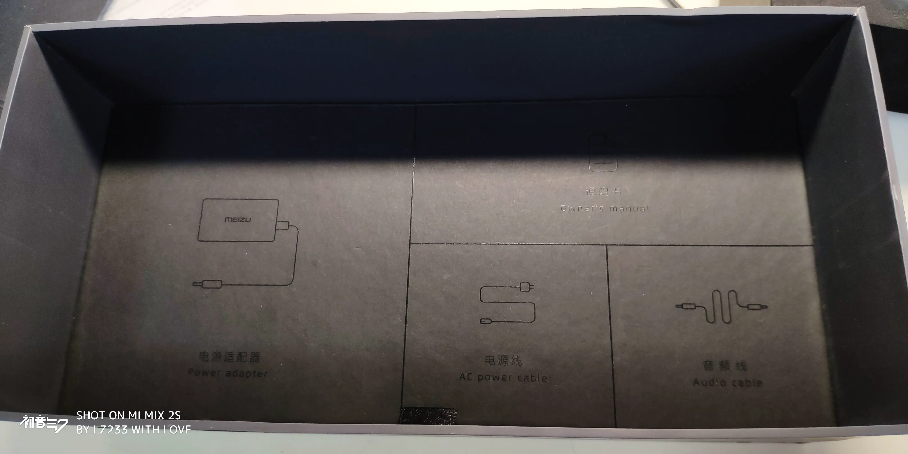
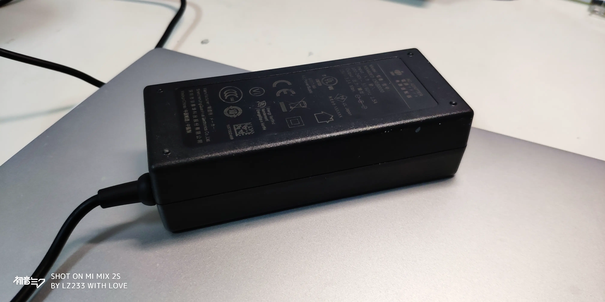
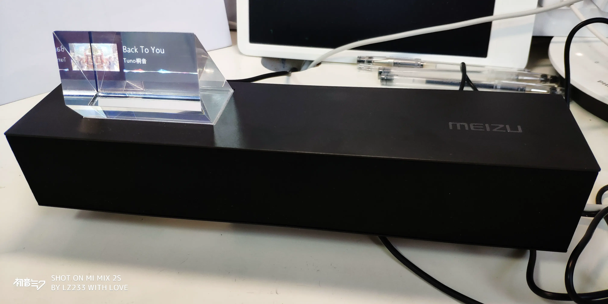
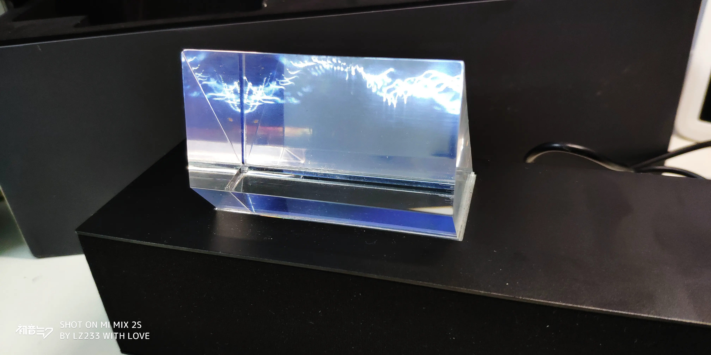
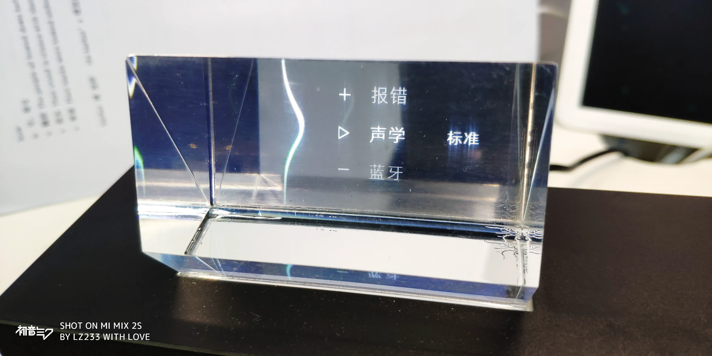
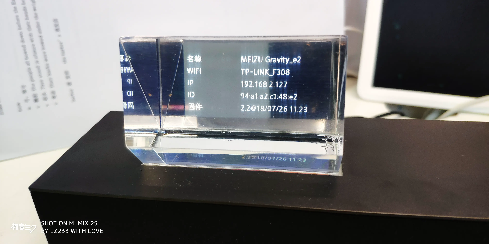

> Gravity 由知名青年设计师坪井浩尚 （Kosho Tsuboi） 与魅族联合设计，它延续了我们 “ Missing Design ” 的理念，首次引入悬镜结构，剔除了一切多余元素的干扰，打破了音乐与设计的界限。即使没有了 "功能" ， Gravity 也是一件精致的艺术品。

---

几日前，我的好友在群组里分享了魅族 Gravity 悬浮音响的照片，激起了我的购买欲。从 2016 跳票到 2018，它还是以它独特的设计吸引了我的目光。

时隔两年，魅族 Gravity 悬浮音响的设计还是否过时？其表现还是否令人满意？从某鱼上购入后，我就有计划写一篇开箱了。

## 开箱

打开盒子就是音响本体，很厚重。从中取出音响的阻尼感不错，但是可能是因为二手的原因，手感没这么完美？

下一层是配件，对于宫格式的设计，强迫症表示强烈好评（

很不爽的电源适配器，从如今的眼光看，实在是有些大了。如果能做到手机一般的大小，便完美。

## 参数

从官网数据来看，魅族 Gravity 悬浮音响采用了德州仪器 TAS5754M 系列芯片，扬声器部分采用了魅族定制的 2*40mm 全频扬声器，同时搭载 Dirac Power Sound™ 扬声器优化数字技术，在这个价位来说物价比还是很高的。详细数据请看下方表格。

|   重量    |      尺寸       | 存储 |  显示屏  |  分辨率   |    系统     |
| :-------: | :-------------: | :--: | :------: | :-------: | :---------: |
| 约 1033 g | 262\*58\*112 mm | 4 GB | 3.0 inch | 320 * 240 | Android 4.4 |

|     蓝牙     | Aux In |    Wi-Fi 制式    | Wi-Fi 标准 |
| :----------: | :----: | :--------------: | :--------: |
| 支持蓝牙 4.1 |  支持  | 802.11 b / g / n |  2.4 GHz   |

| 扬声器单元 | 输出功率 | 频率响应  | 信噪比 | THD+N |
| :--------: | :------: | :-------: | :----: | :---: |
|  2*40 mm   |  2*10 W  | 70-20 kHz | ≥80 dB |  <1%  |

> 以上数据出自[魅族官网](https://www.meizu.com/accessory/gravity.html)或产品说明书。

## 外观

机身本体由长条状腔体和亚克力材质玻璃组成，有机玻璃的透明度还是比较高的，可能是因为二手的原因，表面存在一些磨损和裂痕。在如今市面上一大片圆柱形音响的衬托下，2018 年发布的魅族 Gravity 悬浮音响多少有些另类。但即便如此，我还是很喜欢这种棱角分明的工业设计。

音响后方有 3.5 mm 接口、电源接口以及功能按键。纯黑加上氧化金属表现出了良好的质感，但按键的反馈较生硬。且所有按键和接口都在后面操作起来很麻烦。

正是因为这块棱镜的加入，魅族 Gravity 悬浮音响才有了灵魂。棱镜采用叠加的方式，通过反射 LCD 屏上显示的内容来达到“悬浮”的效果。

## 体验

官网显示魅族 Gravity 悬浮音响支持蓝牙、Aux-In、DLNA三种连接方式，但有些第三方文章写道还支持 Airplay 等连接方式，暂时没有测试。

值得一提的是，仅当使用 DLNA 作为输入源时，音响才支持显示歌曲信息，否则只会显示简单的可视化效果，略显单调。

长按播放键即可打开菜单，可以设置时区等信息，还可以进入休眠模式，显示时钟。

可以查看一些系统信息，但是很可惜，连个 Android 的影子都没有（

|  |  |
| ---------------------- | ---------------------- |

相比于产品本身，配套 APP 则略显粗糙，感觉没有用心。APP 内的音源来源未知，而且动画生硬，还偶现闪退的现象，体验较差。

## 音质

得益于 TI 高性能闭环数字输入功放、Dirac Power Sound™ 扬声器优化数字技术加成，魅族 Gravity 悬浮音响在这个价位的音质表现良好。

实测下来音响的高中低频都比较均衡，很有弹性，比较耐听。和 2020 年同价位段的小爱音箱比较，我个人觉得还要更胜一筹。

## 总结

从发布到现在，两年间家庭音响设备的格局已经有了很大的变化，但是魅族 Gravity 悬浮音响的设计还是让我耳目一新，音质表现也没有让我失望。在清一色圆筒形音箱的背景下，Gravity 有棱有角的设计及其特别，成为它最大的外观亮点。

但是从这个产品的完整度来看，更像是一个半成品，客户端体验差，产品交互体验也比较差，更像是做到一半被砍掉的感觉，实在是可惜。在工业精神和市场利益的权衡下，魅族最终还是没能将这款设计优秀的产品延续下去。