

2023.12.31 跨年烟花 at 苏州湾

（使用 Chrome 在受支持的设备上查看可以获得 HDR 效果）

---

从某天的一个晚上开始，我就在想，相较于每年的流水账，深入探讨一些话题会不会好一点。于是，这篇文章被称为「随笔」。

---

先说说友情和周围的人。

一段好的友情不会让自己变成一座孤岛，让其他朋友与你远去。可是，当我真的陷入如此关系中时，还是会不知所措。

你说，「小圈子」是会必然存在的吗？必然。

当我和某一些人关系越来越近时，是否就意味着我和其他有关系的人疏远了？绝大部分情况下都必须被动地承认，因为人的全部精力是有限的。

承认了以上两点之后，会发现，我以前社交除了某些被动的机遇之外，归根结底完全是一个「小圈子」切换的过程，而大部分普通人其实也和我一样。

所以，既然不能消除「小圈子」，我在之后的日子里就已尽量将我所在的「小圈子」保持开放——不主动拉人进「小圈子」，也不主动排挤任何一个谁。「开放的小圈子」，很怪吧，但这其实在各个国家的邦交中充分体现——各国实际上都主动被动地组成了一个个「小圈子」，却又想对其他国家保持开放。

但这会产生新的问题：我好像和谁关系都不会太好。虽然，大部分情况下，这都会是其他人的社交理念与我不一致而造成的（双方都无主观过错），但是，必须承认，我的这种人格还是存在问题。

从人格推出，这里其实又形成了一个矛盾性的问题：我只是普通人，需要依靠他人的力量，但是，我理想中的社交关系却被迫让我成为「上帝视角」中的一人——与他人而言之为「看客」。

这很麻烦，也让我很累，暂时不知道该怎么办。可能哪一天我死了，就是因为这种心理悖论造成的。

---

再说说我的家乡和原生家庭。希望读者不要借这一点进行攻击就好，我自己知道。

虽然我很希望我的感觉是错的，但是我深刻认识到，家乡那个小县城的经济已经死了，从疫情之后就死了。这主要体现在生活方式和与上海的联系上。

大家似乎都维持着五年前的生活方式，如移动互联网刚刚发展那般。一些具象的描述方式是，这里的外卖还真是最初的「堂食外带」，而不存在外卖厨房之类的东西。就这一点来看，不算什么坏处，问题是人们的生活方式整个停在了以前，以至于我回去的时候，有种时空倒流的感觉。

全国的城乡差距可能都在被拉大，但我没想到狭义的长三角也可以有这么大的差距。还是感到很心疼，想做点什么，或者再也不要让我看到。

---

还有的话题是关于为谁而活，但是我实在没能力写下去了。

---

沉重的话题到此结束，来谈谈比较轻松的话题。

本以为这一年的我毫无变化，但是翻看 Google Photos，却又猛然发现自己变了好多。除了一些内心的变化，从外在看，应该就是对摄影和铁道的兴趣加深。

不知道是不是一种群体的偏见，我们这类人就是会对摄影感兴趣——更准确地来说，从小对电子产品感兴趣的人们。

选择 LUMIX S5II 作为我的第一台入门设备还算是一个正确的选择，在同等价位下几乎给了能给的所有东西，对焦也比上一代进步很多，在大部分情况下都够用。但是现在回想来，也许第一台入门设备不用如此看重纸面参数，以「更易出片」为直接目标进行选购也是另一个可行途径。

我开始越来越相信，摄影是一种艺术表达，这是相机和手机的一个本质区别。除了你当下的构图，后期的手动修图亦是一种艺术创作的过程。如此，你产出的图片，不只是记录这个世界，更是对你当时心境的描绘。

|  |  |
| ------------------------------------------------------------ | ------------------------------------------------------------ |
|  |  |
|  |  |
|  |  |
|  |  |

另一方面是铁道和交通。

这一年，打卡了与铁道有关的地方，考取了驾照，对此的兴趣也步步高涨。这会是我一辈子的兴趣所在吗，我不知道。

|              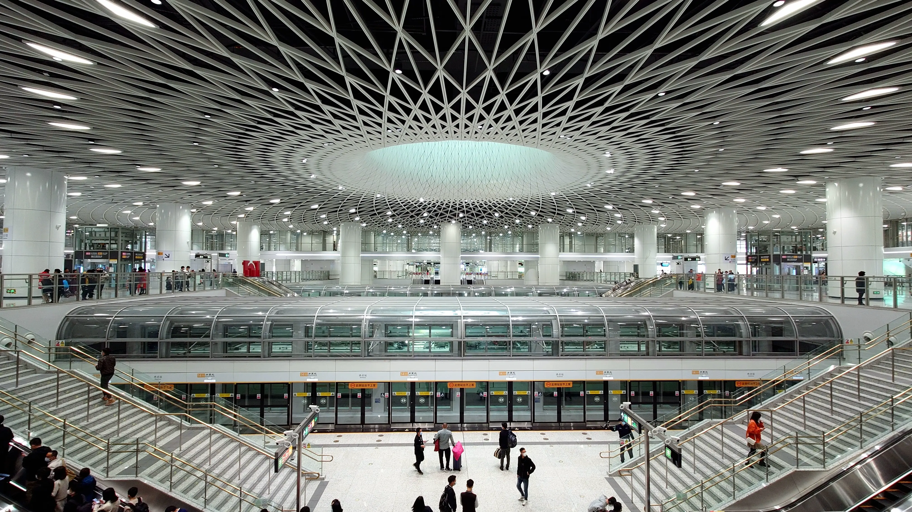              |              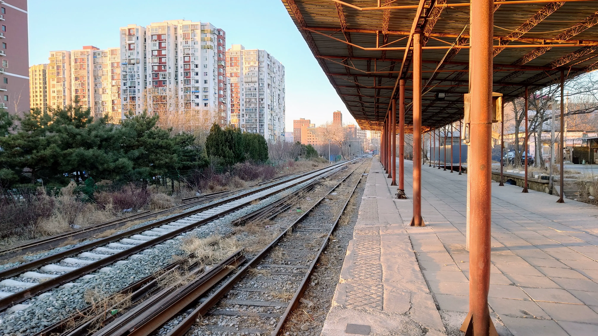              |
| :----------------------------------------------------------: | :----------------------------------------------------------: |
| [岗厦北站，深圳](https://zh.wikipedia.org/wiki/%E5%B2%97%E5%8E%A6%E5%8C%97%E7%AB%99) | [衙门口站，北京](https://zh.wikipedia.org/wiki/%E5%8C%97%E4%BA%AC%E5%9C%B0%E9%93%811%E5%8F%B7%E7%BA%BF#%E8%A1%99%E9%97%A8%E5%8F%A3%E6%94%AF%E7%BA%BF) |
|                            |              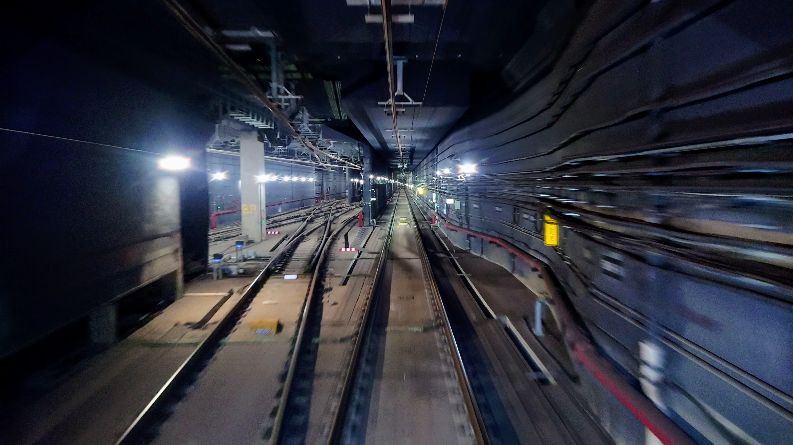              |
| [中国铁道博物馆，北京](https://zh.wikipedia.org/wiki/%E4%B8%AD%E5%9B%BD%E9%93%81%E9%81%93%E5%8D%9A%E7%89%A9%E9%A6%86%E4%B8%9C%E9%83%8A%E5%B1%95%E9%A6%86) | [5 号线开放驾驶室，苏州](https://zh.wikipedia.org/wiki/%E8%8B%8F%E5%B7%9E%E8%BD%A8%E9%81%93%E4%BA%A4%E9%80%9A5%E5%8F%B7%E7%BA%BF#cite_note-10) |
|              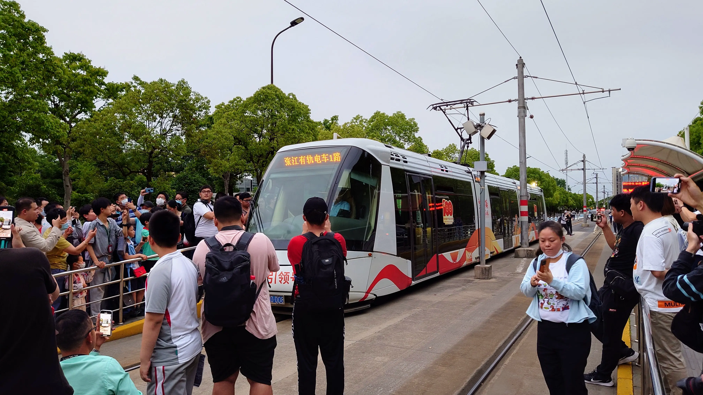              |              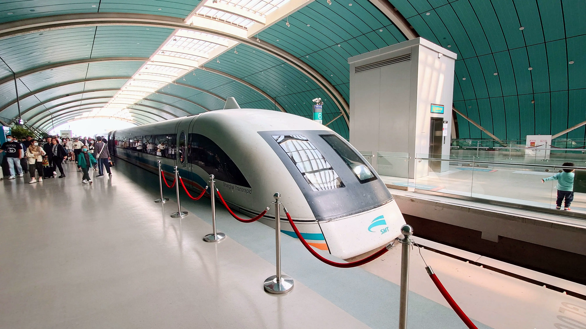              |
| [张江有轨末电，上海](https://zh.wikipedia.org/wiki/%E5%BC%A0%E6%B1%9F%E6%9C%89%E8%BD%A8%E7%94%B5%E8%BD%A6#%E5%81%9C%E8%BF%90) | [磁浮示范线，上海](https://zh.wikipedia.org/wiki/%E4%B8%8A%E6%B5%B7%E7%A3%81%E6%B5%AE%E7%A4%BA%E8%8C%83%E8%BF%90%E8%90%A5%E7%BA%BF) |
|              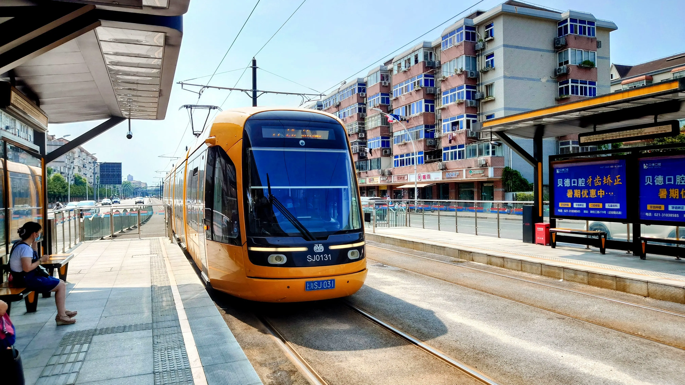              |              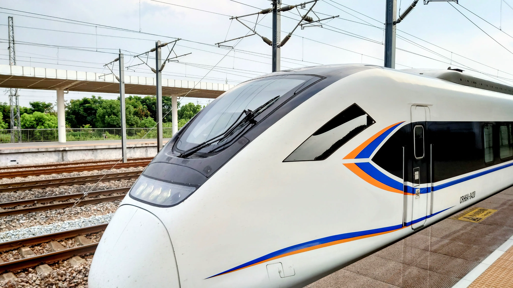              |
| [松江有轨，上海](https://zh.wikipedia.org/wiki/%E6%9D%BE%E6%B1%9F%E6%9C%89%E8%BD%A8%E7%94%B5%E8%BD%A6) | [金山铁路，上海](https://zh.wikipedia.org/wiki/%E9%87%91%E5%B1%B1%E9%93%81%E8%B7%AF) |
|              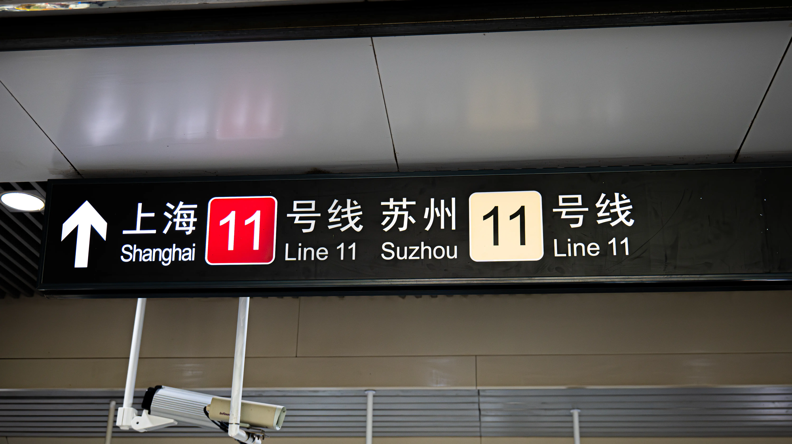              |             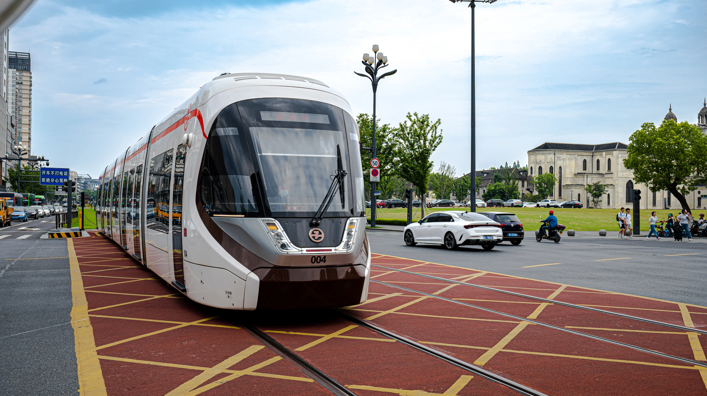              |
| [11 号线试运行首日，苏州](https://zh.wikipedia.org/wiki/%E8%8B%8F%E5%B7%9E%E8%BD%A8%E9%81%93%E4%BA%A4%E9%80%9A11%E5%8F%B7%E7%BA%BF) | [T1 有轨示范线，嘉兴](https://zh.wikipedia.org/wiki/%E5%98%89%E5%85%B4%E6%9C%89%E8%BD%A8%E7%94%B5%E8%BD%A6T1%E7%BA%BF) |
|             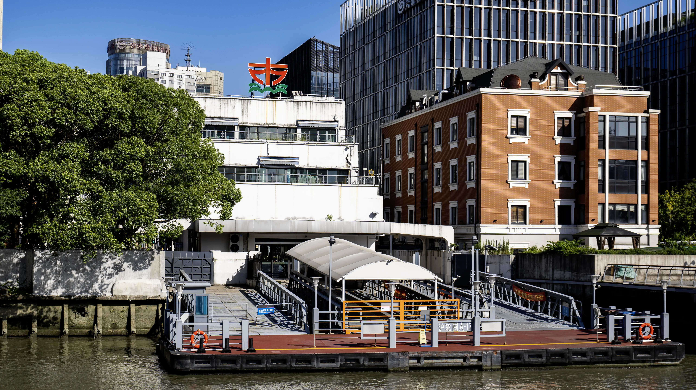              |             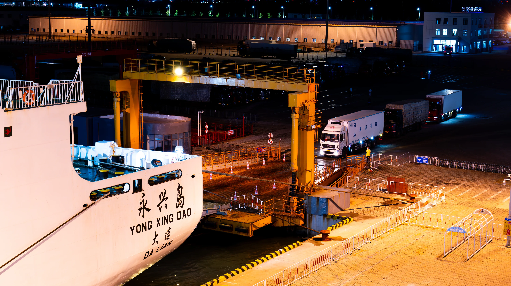              |
| [黄浦江轮渡，上海](https://zh.wikipedia.org/wiki/%E4%B8%8A%E6%B5%B7%E8%BD%AE%E6%B8%A1) | [渤海客运轮渡，威海](https://zh.wikipedia.org/wiki/%E5%A8%81%E6%B5%B7%E6%B8%AF) |
|             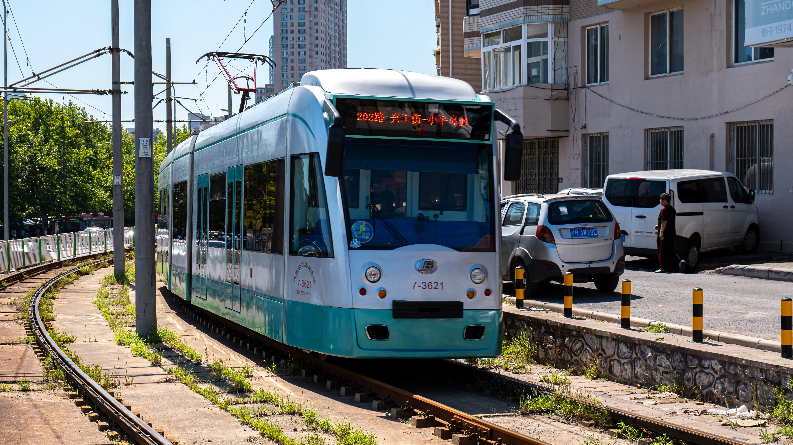              |             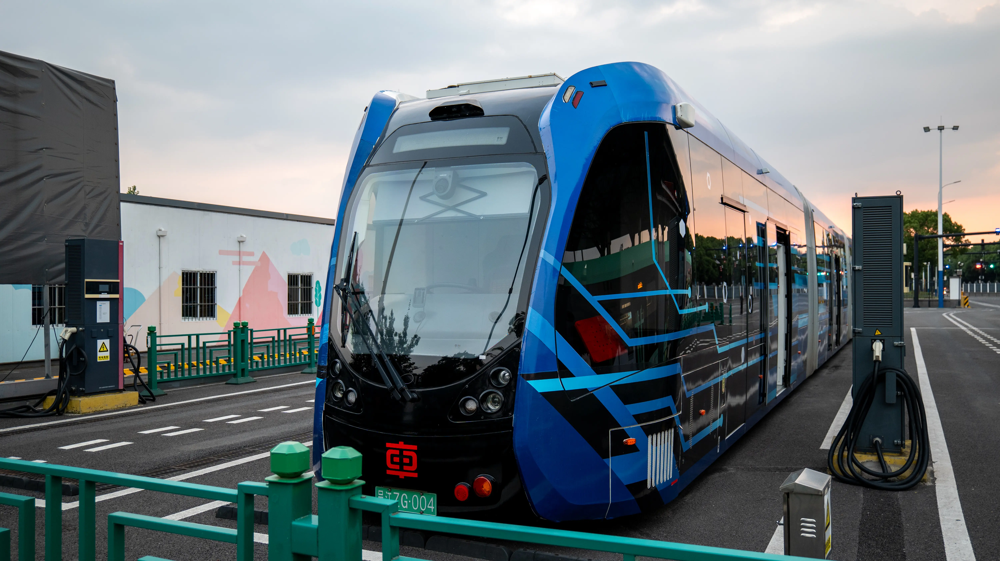              |
| [日留有轨，大连](https://zh.wikipedia.org/wiki/%E5%A4%A7%E8%BF%9E%E6%9C%89%E8%BD%A8%E7%94%B5%E8%BD%A6) | [同里智轨，苏州](https://zh.wikipedia.org/wiki/%E6%99%BA%E8%BD%A8#%E4%B8%AD%E5%9C%8B%E5%A4%A7%E9%99%B8) |
|             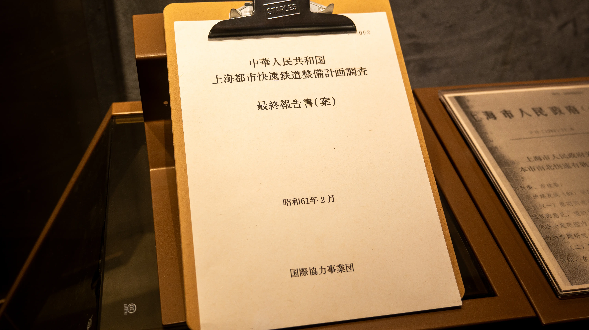              |             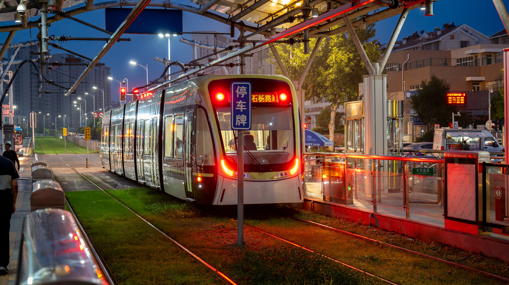              |
| [上海地铁博物馆，上海](https://zh.wikipedia.org/wiki/%E4%B8%8A%E6%B5%B7%E5%9C%B0%E9%93%81%E5%8D%9A%E7%89%A9%E9%A6%86) | [麒麟有轨，南京](https://zh.wikipedia.org/wiki/%E5%8D%97%E4%BA%AC%E6%9C%89%E8%BD%A8%E7%94%B5%E8%BD%A6#%E9%BA%92%E9%BA%9F%E6%9C%89%E8%BD%A8%E7%94%B5%E8%BD%A6) |
|             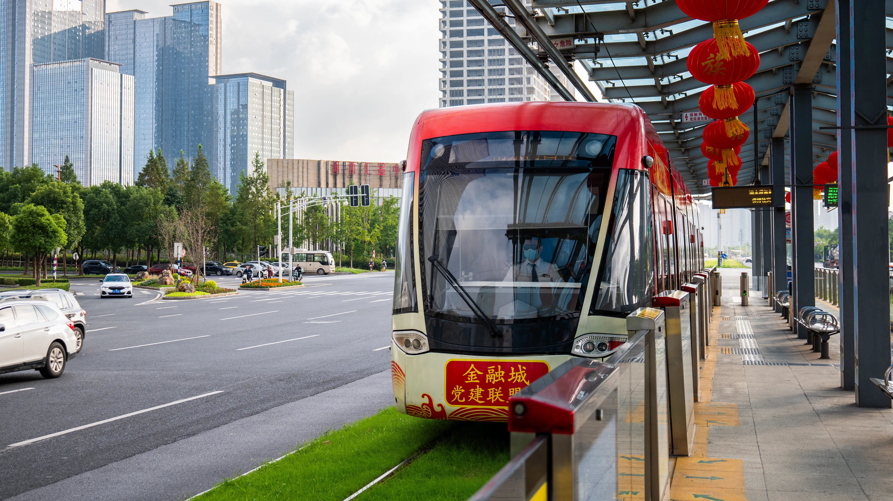              |             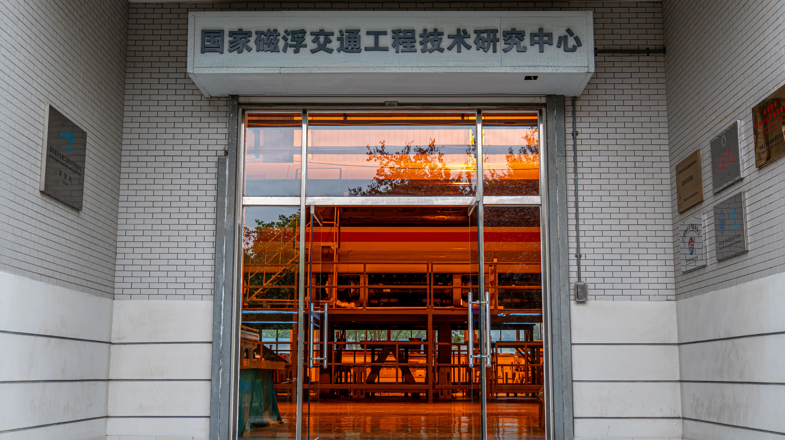              |
| [河西有轨，南京](https://zh.wikipedia.org/wiki/%E5%8D%97%E4%BA%AC%E6%9C%89%E8%BD%A8%E7%94%B5%E8%BD%A6#%E6%B2%B3%E8%A5%BF%E6%9C%89%E8%BD%A8%E7%94%B5%E8%BD%A6) |                       磁浮试验线，上海                       |
|             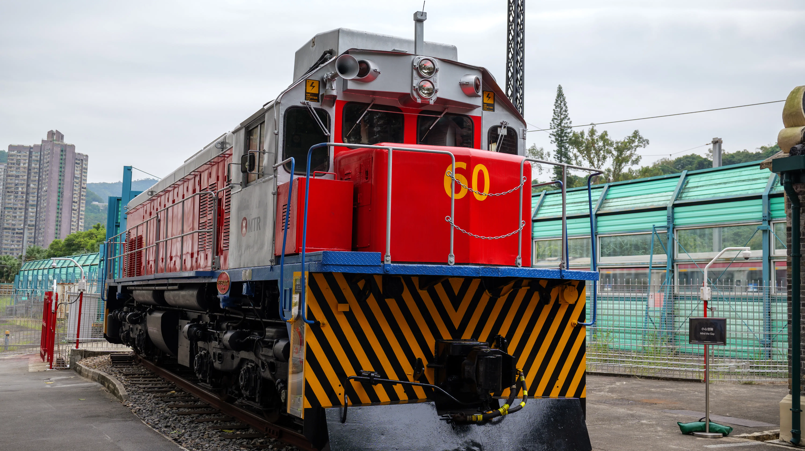              |             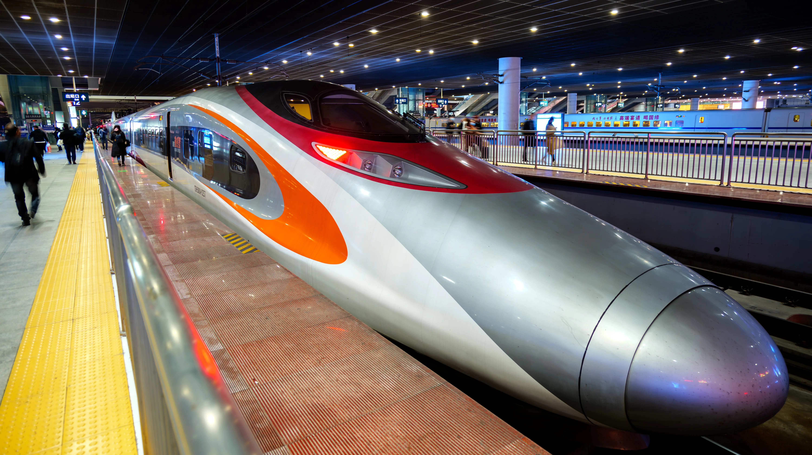              |
| [香港铁路博物馆，香港](https://zh.wikipedia.org/wiki/%E9%A6%99%E6%B8%AF%E9%90%B5%E8%B7%AF%E5%8D%9A%E7%89%A9%E9%A4%A8) | [港铁动感号，深圳](https://zh.wikipedia.org/wiki/%E6%B8%AF%E9%90%B5%E5%8B%95%E6%84%9F%E8%99%9F%E9%AB%98%E9%80%9F%E9%9B%BB%E5%8B%95%E5%88%97%E8%BB%8A) |
|             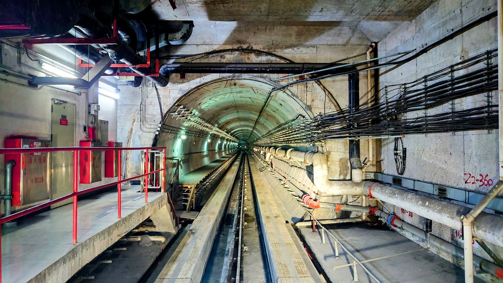              |             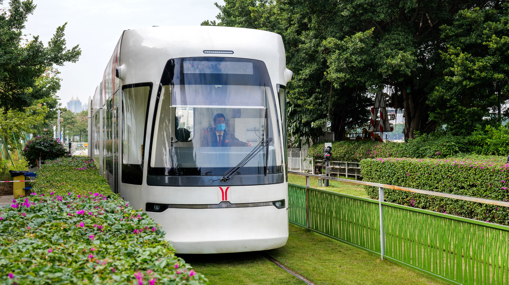              |
| [APM 线，广州](https://zh.wikipedia.org/wiki/%E7%8F%A0%E6%B1%9F%E6%96%B0%E5%9F%8E%E6%97%85%E5%AE%A2%E8%87%AA%E5%8A%A8%E8%BE%93%E9%80%81%E7%B3%BB%E7%BB%9F) | [海珠有轨，广州](https://zh.wikipedia.org/wiki/%E5%B9%BF%E5%B7%9E%E6%B5%B7%E7%8F%A0%E6%9C%89%E8%BD%A8%E7%94%B5%E8%BD%A61%E5%8F%B7%E7%BA%BF) |
|             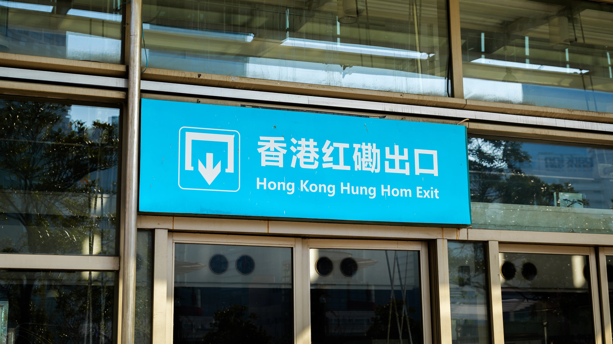              |                           |
| [Z100 直通车出口，上海](https://zh.wikipedia.org/wiki/Z99/Z100%E6%AC%A1%E5%88%97%E8%BB%8A) | [3/11 贯通运行首日，苏州](https://zh.wikipedia.org/wiki/%E8%8B%8F%E5%B7%9E%E5%B8%82%E8%BD%A8%E9%81%93%E4%BA%A4%E9%80%9A11%E5%8F%B7%E7%BA%BF%E4%B8%8E3%E5%8F%B7%E7%BA%BF%E5%B7%A5%E7%A8%8B%E8%B4%AF%E9%80%9A%E8%BF%90%E8%90%A5%E6%94%B9%E9%80%A0%E9%A1%B9%E7%9B%AE) |

在为这篇文章做结的时候，还在考虑要不要删掉之前的随笔部分。如果不删的话，这算是一种「和解」吗？不，根本不能算，无论输出这些文字与否，现实似乎都不能改变。

所以，不要谎言，我要面对现实的复杂度。
