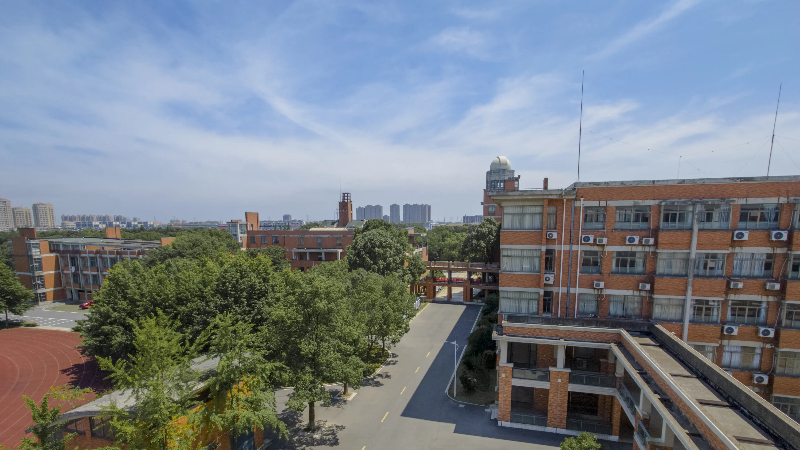

于是呢，还是要记录一下我与善高的这段日子，以防，记忆逐渐淡化。

## 学业

### 技术

浙江大概是全国唯一将「技术」作为高考科目的省，但其现状依旧囿于应试教育的「牢笼」之中。以信息技术举例，高中三年的实质性知识仅仅是冒泡排序、选择排序和对分查找，而题目却千奇古怪，以致有很大一部分应试的比例存在，而不需要你对算法有真正的了解。

从小积累下来的计算机知识和对此类事物的兴趣，让我在这门课上的体验还算是愉快。在高二上将新知识学完之后，每天的作业基本就是试卷和练习，从而在高三形成「肌肉记忆」。

我们也是使用 Visual Basic 的最后一届，下一届则是 Python。难度应该会有所提高，但希望不要再像这样死板应试了吧。

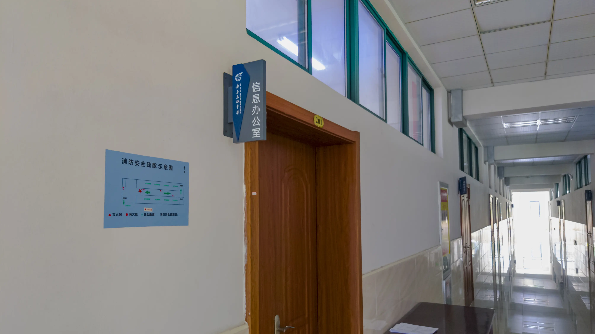

### AP 班

我们貌似是有提前招生考试的最后一届了。高二的时候，看到隔壁教学楼刚来的初中生们，还在感慨时间飞逝，转眼间也就又过去了一年，真快。

当初的提前招生内容多是奥赛和一些稀奇古怪的题目，个人而言没对高中生活有什么帮助。不过，为此，各个初中应该还是专门设置了「培优班」，在周六教授这些超纲内容。对于我和周围的一些同学来说，在当时，逃课是一种乐此不疲并且本身能视为乐趣的一种活动，可以之后放在另外的文章讲讲。

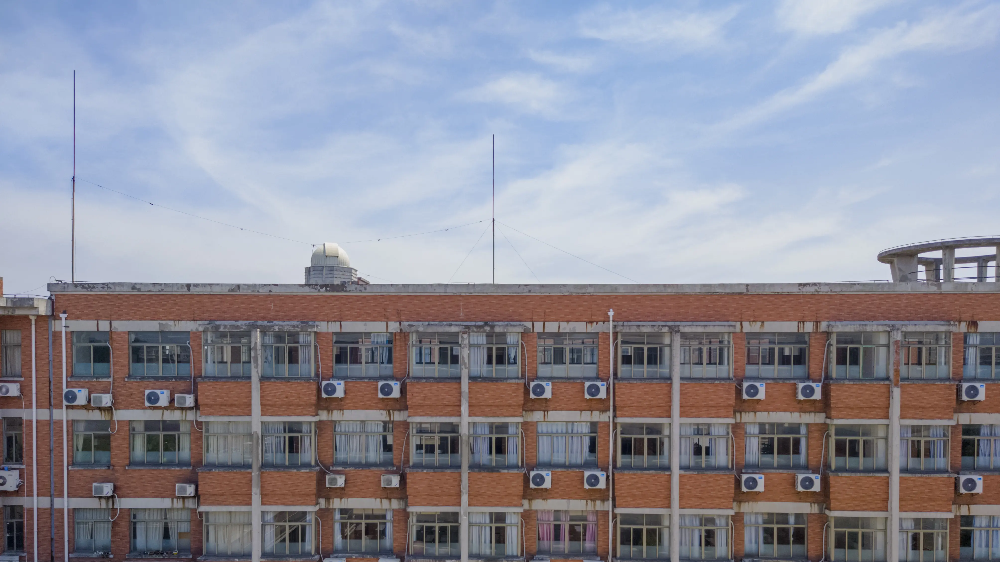

## 活动

### 留学交流

高一时候的活动了，也是最后一次。后来因为疫情的爆发，显然没有去成。但是，应该为我以后的观念进行了一定程度上的铺垫。

记得在提及「原子」之类的概念时，他们都会说不知道，似乎一定程度上显示出了我们的教育有多「卷」。在校外远看夜晚灯火通明的教学楼时，他们问我: "What are they doing?"，其实也算是在意料之中，但对当时的我还是冲击巨大的。

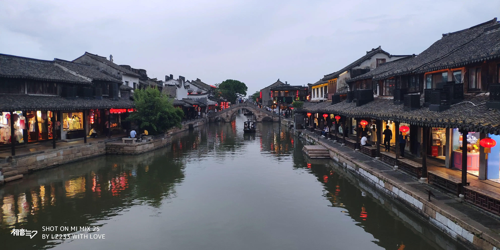

### 研学

研学也因疫情而极度缩水。刚来善高的时候就听过学长对我们描绘的南京之旅，但是，经历的却是高一的绍兴、高二的嘉善周边游和高三的云澜湾。

绍兴参观的地点有鲁迅故居、柯岩风景区、绍兴酒文化博物馆——统统不感兴趣。唯一可以提的是当晚偷偷点的外卖，和鲁迅故居「走私」的星巴克。不在于食物本身，这种体验是在高中之后很难追求到的。

高二和高三的经历似乎就更显暗淡了。几乎都是昏昏沉沉的一天，没有什么记忆。

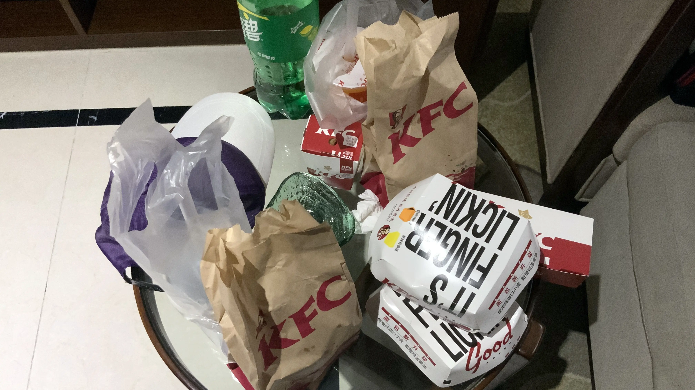

## 一些地点

### 食堂

当初进善高的时候，可以说善高的伙食是一个大跃进，相比之前初中的伙食，但是也在一年不如一年地开倒车。可能是因为吃厌了的关系，总觉得越来越不好吃了。

应该是高三开始实行的点餐制度，从那之后，真正的盖浇饭就「销声匿迹」，取而代之的是更贵且浇头更少的盖浇饭。每天晚餐的饭团也是在这个时候消失的，取而代之为星期二专供的紫菜包饭。

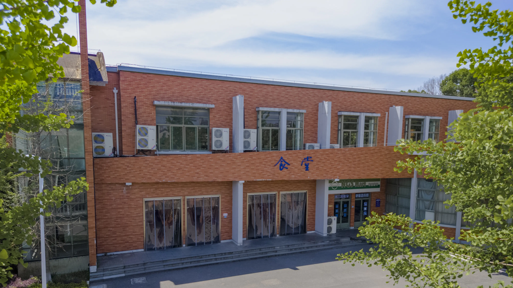

### 天文台

高一的时候似乎是有天文社的招新，当时参加的人很多，我也第一次能从楼梯上去，得以见到天文台内景。里面全是灰，楼梯也生锈了，看起来根本没人用，真正在用的是楼下的一排天文望远镜。

高三挂横幅的时候也上去过一次，~~差点被抓到，~~算是故地重返，依旧没有什么改变。果然还是名存实亡啊。

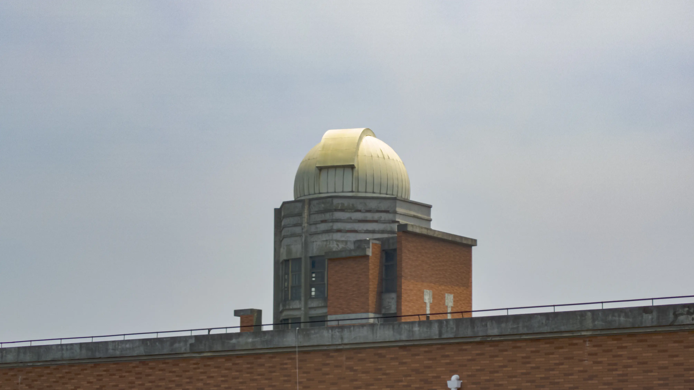

### 图书馆

很难不说善高的图书馆不丰富，起码，你可以找到足够多的日本文学。这在很大一部分程度上丰富了高中单调的生活，也为我之后的阅读取向铺平道路。图书馆应该有三本《挪威的森林》，有一本无论如何都应该借到手看看，上面有前几届学长的表白与情话，当然还包括我的（你猜是哪个？）。

一次最多借两本，一共最多借五本，理论上的限制是一个月，但其实超过了也不会怎么样，所以放心看就好。

### 实验楼地下室

一天晚自习和同学偶然发现的，因为刚下过雨，所以还有积水。后来去看就是锁着的，听前辈说是化学准备间，但看起来很阴森，到现在都没能进去。

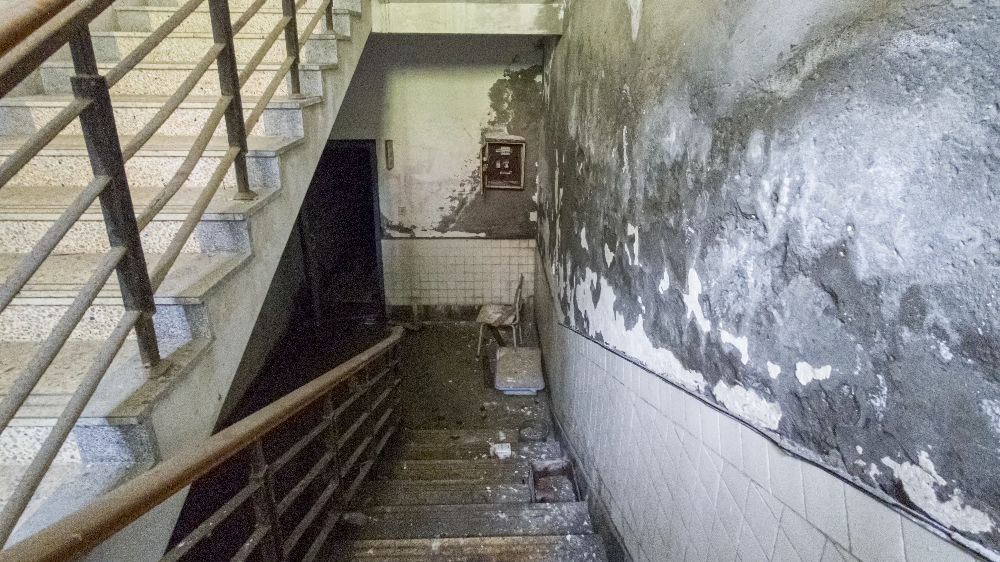

### 选修教室

很多有意思的涂鸦都能在这里找到，其中不乏「专业」水准的作品，大家真是多才多艺。特别是这个，很棒！

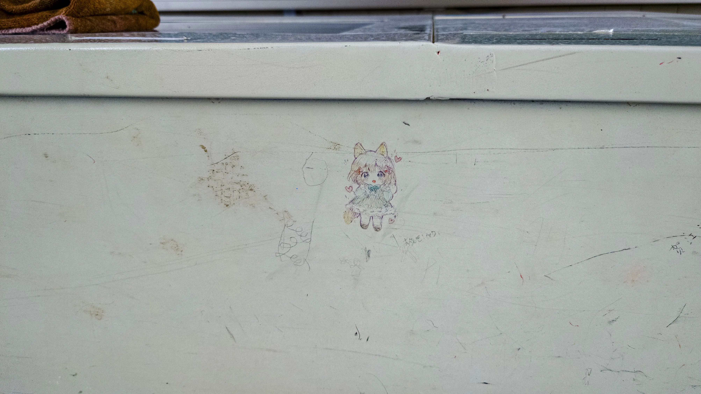

### 后门的墙

经常在这里拿外卖。同时，也是个表白墙。

上面有「非官方」小卖部的电话，可以买可乐之类的「违禁品」。

外卖需要从有防盗网的墙上拿下来，或者让外卖员用竹竿吊进来。记得有一次不小心把别人的外卖从墙上弹下去了，挺不好意思的。

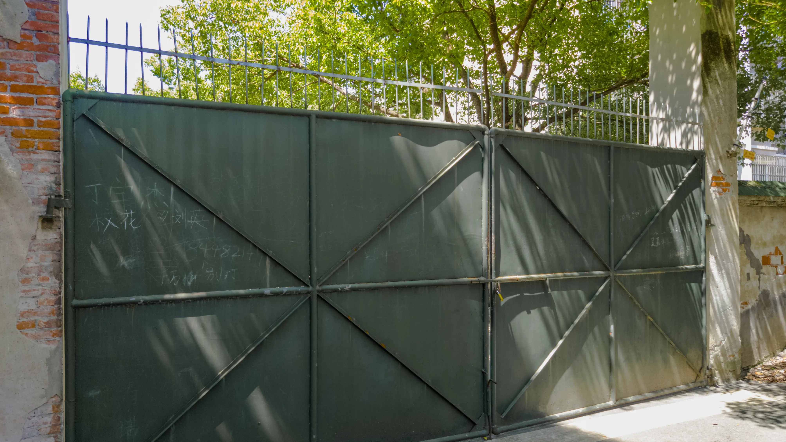

### 实践楼的小花园

或许在校的很多人都看过这个地方，但真正上去的没几个吧。建议可以找一天晚自习溜过去，别被老师发现就行。

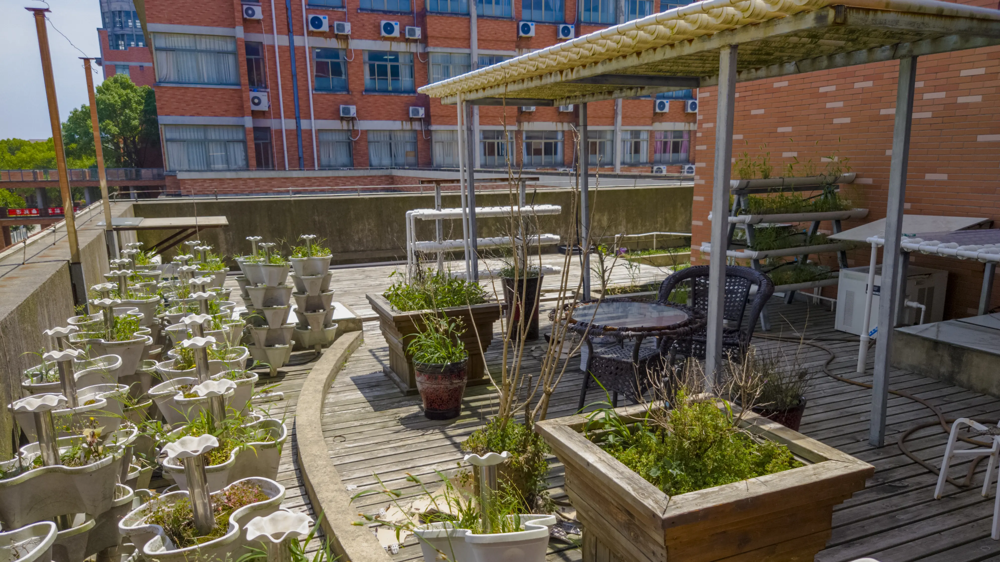

## Episode

### 夏日午后的数学课

初三的时候就被「高级中学」有空调而吸引过来，而现在，似乎每所学校都有了。随空调带来印象最深的体验当然就是夏日午后的数学课：刚刚睡醒的你听着老师讲课，却望向窗外湛蓝的天空、网格分布的空调外机，能听到此起彼伏的蝉鸣。

如果没有亲身体会，很难感觉到，这是语言难以描述的。很可惜，也只是在高二体验过几次，以后就没有感觉了。

### 外卖的进化历程

外卖据点主要是三个：体育馆侧门、后门、篮球场；分别在不同时期使用，像游击战。

高一并没有了解到外卖，直到前辈们将他们的外卖卡片「传」给我们……还记得第一次外卖是在后门拿的，「人生地不熟」，还是很紧张。

后来，就轻车熟路多了，但是，和我一样轻车熟路的也就更多了。直到有一次年级大会，年级部主任明确重申「最近外卖现象猖獗，严抓严打」这才稍微平息。不过，很快年级部的计划就泡汤了，学生们和保安打着时间差，在三个地点「辗转反侧」，这大概也是点外卖中最有意思的一段经历。

其实保安也是听从上级要求，实在不想管了就和我们说：「人别去得太多，别让监控看见。」大家相视一笑，从此点外卖的人又逐渐多起来。

再到了下个学期，学校直接把体育馆侧门用铁皮封了，于是，后门又成了主要据点。直到现在，学校还没有新的打击外卖行动出现，希望这是一种平衡的表现。

点外卖的方式也是变化的。我们是第一届明确不能带手机的学生，所以在一开始就用电话点。第一次运动会，大概是我们第一次尝试用手机点外卖的时候。而到了高三，就基本是用手机点了。不需要问为什么又可以带手机了，问就是你来就知道。

### 皮划艇策划

非常有意思的是，学校侧门的河是不设围墙的，而类似于码头的存在。「严抓严打」期间，同学们就想到，能不能购置皮划艇划到对岸拿外卖。

这条河水流速度不快，而河道也不宽，可行度其实很高。而后来了解到，其实在我们前几届就已经有类似的策划了，但最后都没有付诸实践。当然，鉴于「严抓严打」没过多久就泡汤了，自然我们的计划最后也没有实行。

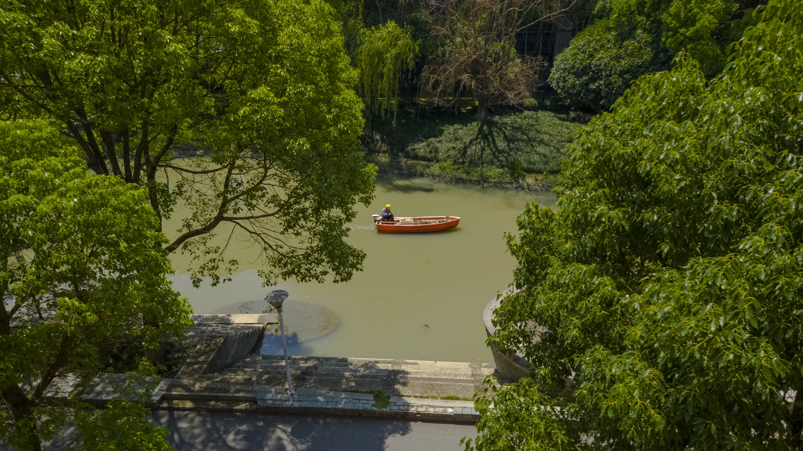

## 尾声

还有很多想写的东西，但都因为缺乏素材没法在这呈现，同时，也还有很多未能用上的素材，为此感到遗憾。晚自习的晚霞、高考前的喊楼，大概都是这辈子没法完全忘却的。

身在当中的时候，确实感觉很痛苦。同样地，现在也不忍看到当代高中生的生活，太痛苦了，不是吗？但是呢，就仅仅是想着这些有意思的片段吧。无论如何，向前看。

就，只能从这里开始，说一声不舍的再见了吧。再见，善高。
