

    

        <iframe src="//player.bilibili.com/player.html?aid=78978349" scrolling="no" border="0" frameborder="no" framespacing="0" allowfullscreen="true" width="100%" height="100%"> </iframe>
    

---

七天相恋，一生难忘。

小野道的《七日》打破了二三次元，我感受到一种前所未有的甜度。我想，如果能把 PV 里的地点全找出来并自己走一趟，或许会让我更加沉溺在这甜味里罢。

---

开头就是一副令人羡慕的魔都场景~~（为什么要说羡慕呢）~~。根据图中的标志物找了好一会，我才在地图上找到这个地方。

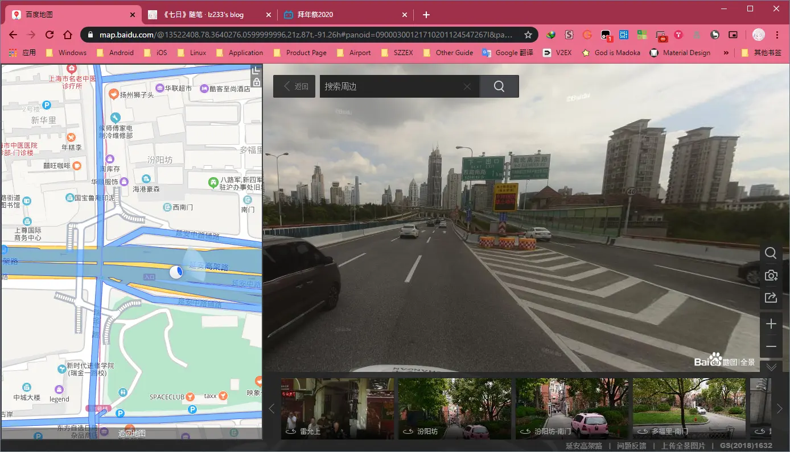

> [百度地图](https://map.baidu.com/@13522104.107078683,3640295.41422638,18.73z) [百度地图全景](https://map.baidu.com/@13522408.78,3640276.0599999996,21z,87t,-91.26h#panoid=09000300121901261115021797G&panotype=street&heading=111.32&pitch=-8.85&l=21&tn=B_NORMAL_MAP&sc=0&newmap=1&shareurl=1&pid=09000300121901261115021797G) [百度地图建模](https://map.baidu.com/@13522552.089907248,3640273.2900513727,21z,87t,-91.26h)

---

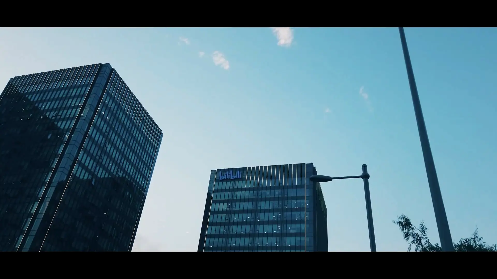

这个建筑大家都很熟悉，是 B 站的总部，不用多说。

> [百度地图](https://map.baidu.com/poi/BILIBILI公司/@13526924.748929268,3651380.5810709046,17.99z?uid=86d6359d91e7ed17a1d23098&from=fav&ugc_type=3&ugc_ver=1&device_ratio=1&compat=1&querytype=detailConInfo&da_src=shareurl)

---

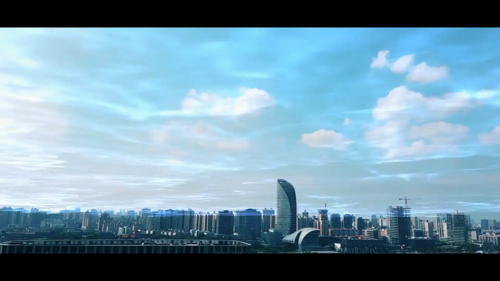

这个地方好不容易才找到，根据原 PV 拍摄的视角来看，应该是在黄浦江对岸拍摄的。考虑到黄浦江近对岸没有高大的建筑，初步猜测使用无人机拍摄。

> [百度地图](https://map.baidu.com/@13529682.21,3643886.39,21z) [百度地图全景](https://map.baidu.com/@13529674.039999997,3643882.26,21z,87t,-159.78h#panoid=09000300121708241253085281Y&panotype=street&heading=8.99&pitch=19.87&l=21&tn=B_NORMAL_MAP&sc=0&newmap=1&shareurl=1&pid=09000300121708241253085281Y)

---

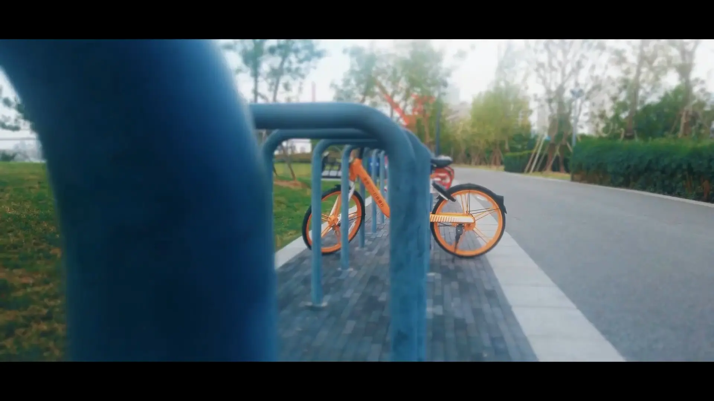

根据弹幕在药草园北侧。

> [百度地图](https://map.baidu.com/poi/%E8%8D%AF%E8%8D%89%E5%9B%AD/@13522426.621046357,3640237.269581456,19z?uid=6761156f5cda95bc8c1a8901&info_merge=1&isBizPoi=false&ugc_type=3&ugc_ver=1&device_ratio=1&compat=1&pcevaname=pc4.1&querytype=detailConInfo&da_src=shareurl)

---

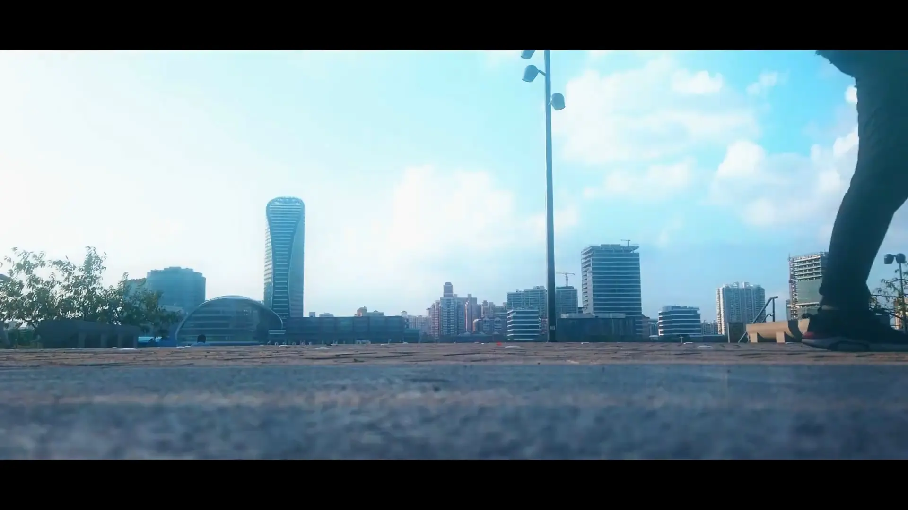

这个地点在地图上没有，但是可以大致推测位于如下方位。

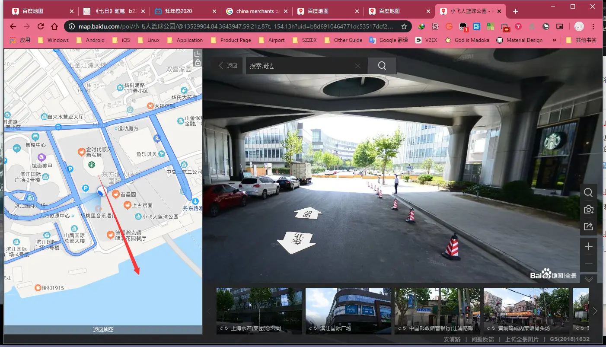

---

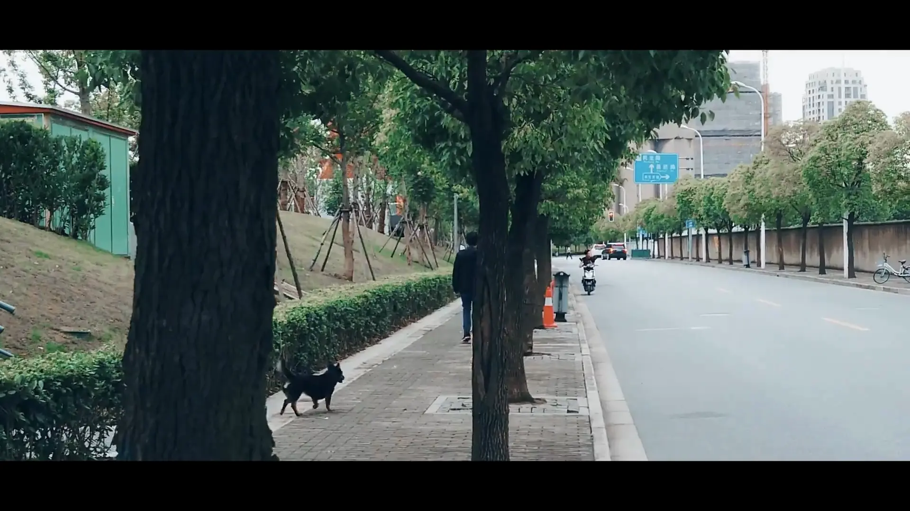

这个就在黄浦江对面啦。从全景看，和 PV 还是会有差距呢。

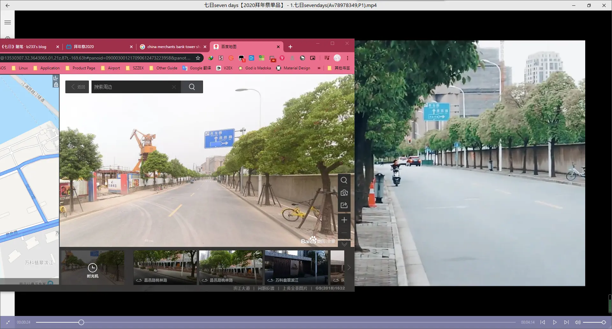

> [百度地图](https://map.baidu.com/@13530109.35,3643161.49,18.78z) [百度地图全景](https://map.baidu.com/@13530109.35,3643161.49,21z,87t,-70.11h#panoid=09000300121709061247305595B&panotype=street&heading=70.1&pitch=0&l=21&tn=B_NORMAL_MAP&sc=0&newmap=1&shareurl=1&pid=09000300121709061247305595B)

---

通过全景找不到。等实地探访罢。

---

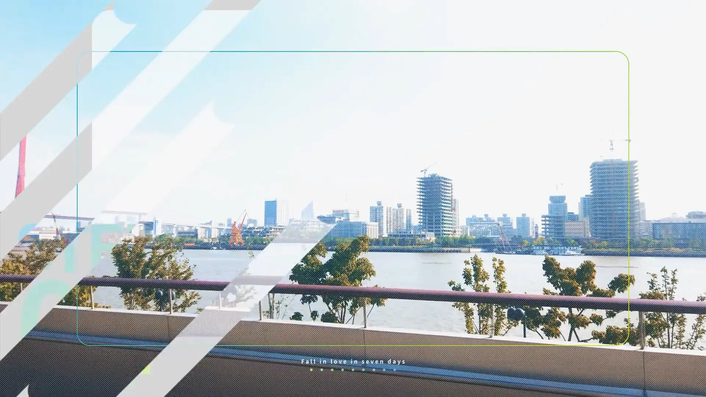

初步猜测在这一块，具体还得等实地探访。

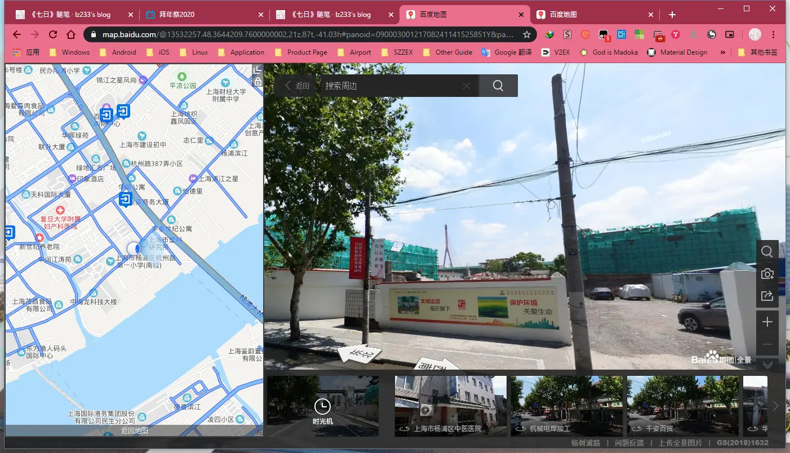

> [百度地图](https://map.baidu.com/@13532257.48,3644209.7600000002,21z,87t,-41.03h#panoid=09000300121708241141525851Y&panotype=street&heading=109.67&pitch=6.08&l=21&tn=B_NORMAL_MAP&sc=0&newmap=1&shareurl=1&pid=09000300121708241141525851Y)

---

找到了地方，但是没找到拍摄的角度。

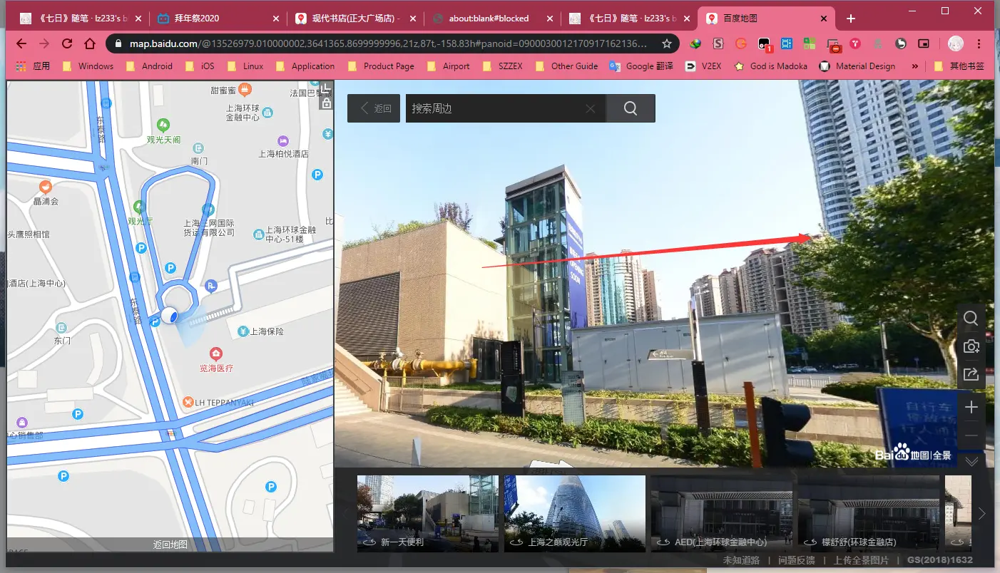

有可能在这拍的？

> [百度地图](https://map.baidu.com/@13526985.75,3641473.73,18.44z,22.79h) [百度地图全景](https://map.baidu.com/@13526311.08,3641673.9,21z,87t,22.79h#panoid=09000300121709171621369725B&panotype=street&heading=112.44&pitch=15.2&l=21&tn=B_NORMAL_MAP&sc=0&newmap=1&shareurl=1&pid=09000300121709171621369725B)

---

此处看了下 B 站的弹幕，推测应该在徐汇滨江绿地。

> [百度地图](https://map.baidu.com/poi/徐汇滨江绿地/@13522132.77916,3634898.03003,17.17z,22.79h?uid=ab8fde739f19a118591093bd&ugc_type=3&ugc_ver=1&device_ratio=1&compat=1&querytype=detailConInfo&da_src=shareurl) [百度地图全景](https://map.baidu.com/poi/徐汇滨江绿地/@13522103.889999999,3634801.1399999997,21z,87t,70.37h#panoid=09000300121710220948420397G&panotype=street&heading=109.81&pitch=-4.82&l=21&tn=B_NORMAL_MAP&sc=0&newmap=1&shareurl=1&pid=09000300121710220948420397G)

---

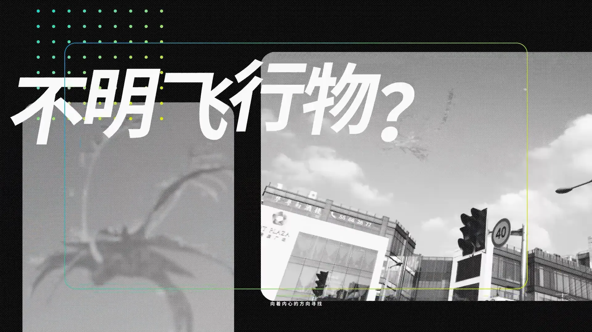

这个很好找，因为它不在市中心嘛。

> [百度地图](https://map.baidu.com/@13526767.609281257,3651574.3861616184,20.37z) [百度地图全景](https://map.baidu.com/@13526774.76,3651590.25,21z,87t,-89.68h#panoid=09000300121708201252129396A&panotype=street&heading=91.4&pitch=9.3&l=21&tn=B_NORMAL_MAP&sc=0&newmap=1&shareurl=1&pid=09000300121708201252129396A)

---

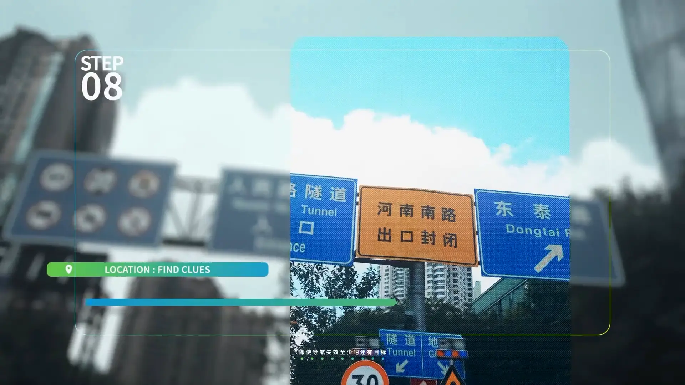

路牌太明显了啦……

> [百度地图](https://map.baidu.com/@13526784.273379095,3641862.745543243,18.92z,-112.11h?uid=825365a721f094a72de67b3a&ugc_type=3&ugc_ver=1&device_ratio=1&compat=1&querytype=detailConInfo&da_src=shareurl) [百度地图全景](https://map.baidu.com/poi/%E4%B8%9C%E6%B3%B0%E8%B7%AF/@13526856.23,3641839.14,21z,87t,-112.11h?uid=825365a721f094a72de67b3a&ugc_type=3&ugc_ver=1&device_ratio=1&compat=1&querytype=detailConInfo&da_src=shareurl#panoid=09000300011512171527536298D&panotype=street&heading=251.32&pitch=0&l=21&tn=B_NORMAL_MAP&sc=0&newmap=1&shareurl=1&pid=09000300011512171527536298D)

---

根据弹幕，在人民公园？

> [百度地图](https://map.baidu.com/poi/人民公园/@13523189.781631205,3641382.2210638295,18.35z?uid=1816533483da9005fa2d61ab&ugc_type=3&ugc_ver=1&device_ratio=1&compat=1&querytype=detailConInfo&da_src=shareurl)

---

应该是翠华餐厅，哪一家不太清楚。

> [百度地图](https://map.baidu.com/poi/翠华餐厅(正大广场店)/@13518005.930972222,3642042.5949999997,16.32z?uid=cfbeade472e55749f2193768&ugc_type=3&ugc_ver=1&device_ratio=1&compat=1&querytype=detailConInfo&da_src=shareurl)

---

看到隧道上的字了嘛~

> [百度地图](https://map.baidu.com/@13528522.165433222,3642095.538716745,19.28z,-4.49h) [百度地图全景](https://map.baidu.com/@13528395.949999997,3642760.58,21z,87t,-4.49h#panoid=09000300121709141159008605B&panotype=street&heading=281.6&pitch=-1.23&l=21&tn=B_NORMAL_MAP&sc=0&newmap=1&shareurl=1&pid=09000300121709141159008605B)

---

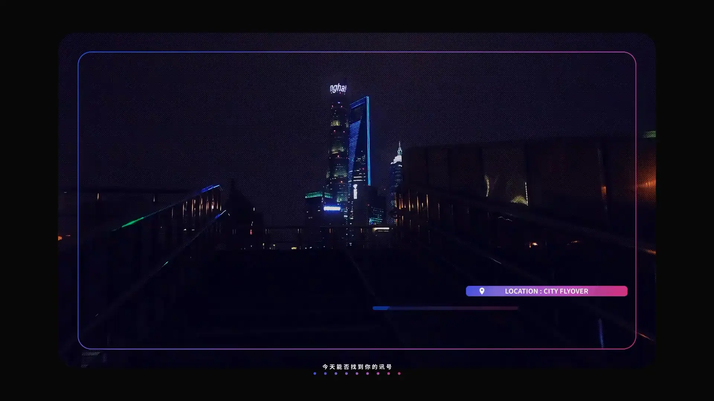

找到了大概的方位，没找到拍摄地点，根据原 PV 来看，也不可能是无人机拍摄。初步推断是因为建模和全景太旧了，等实地探访。

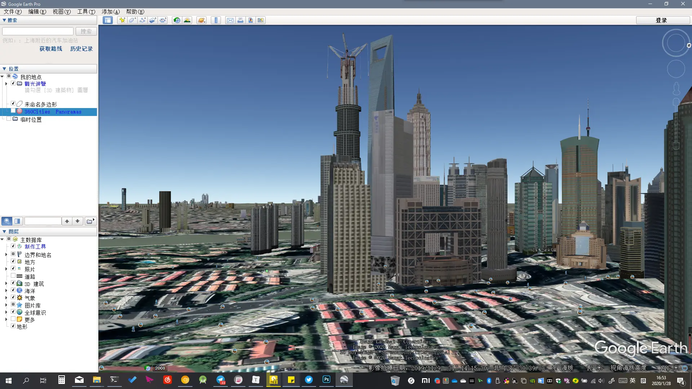

> [Google Earth](https://earth.google.com/web/@31.2347066,121.51237476,67.07100504a,0d,35y,-79.00606914h,89.83451842t,0r)
>
> 使用 [Google Earth Pro](https://www.google.com/intl/zh-CN_ALL/earth/versions/#earth-pro) 可以查看 3D 建模。

---

盲猜外滩，太黑了不好找。

---

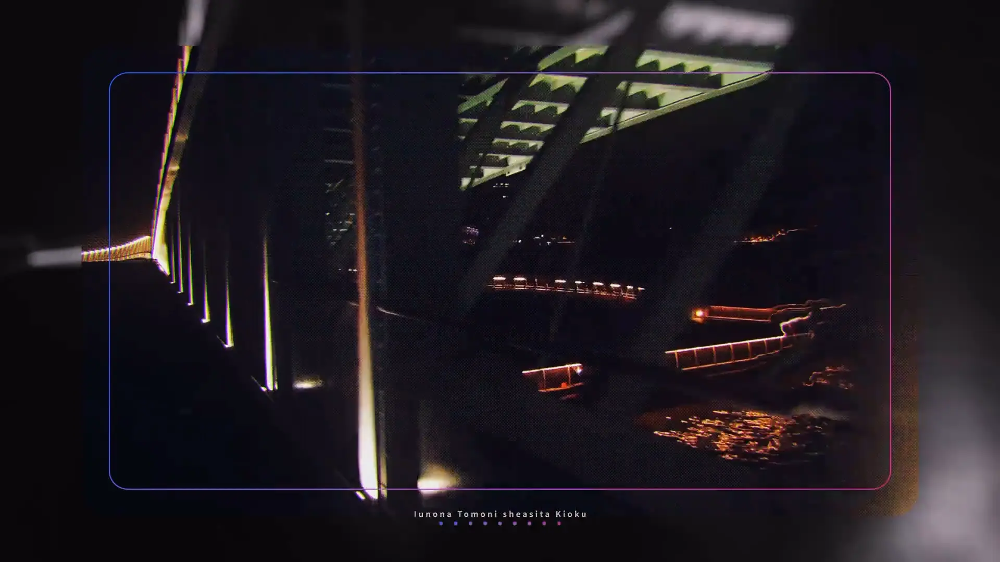

没找到。（哭

---

不确定。根据弹幕在正大广场。

> [百度地图](https://map.baidu.com/poi/正大广场/@13526125.888067374,3641947.0949999997,19z?uid=5fb82246fcf807f9bea240b6&ugc_type=3&ugc_ver=1&device_ratio=1&compat=1&querytype=detailConInfo&da_src=shareurl)

---

不知道是哪家……根据弹幕是正大广场的。等实地探访。

> [百度地图](https://map.baidu.com/poi/现代书店(正大广场店)/@13520717.656388577,3640042.19,13.72z?uid=7b258f3055ddbc5d0bf5ebac&ugc_type=3&ugc_ver=1&device_ratio=1&compat=1&querytype=detailConInfo&da_src=shareurl)

---

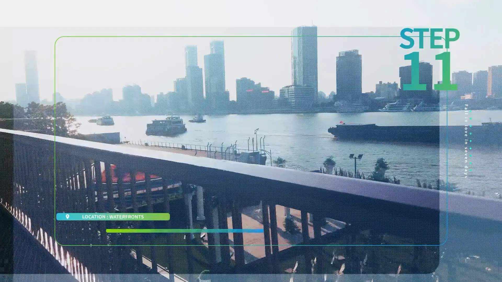

找不到…… Google Earth 上相似的地方太多了。

---

也没找到……

---

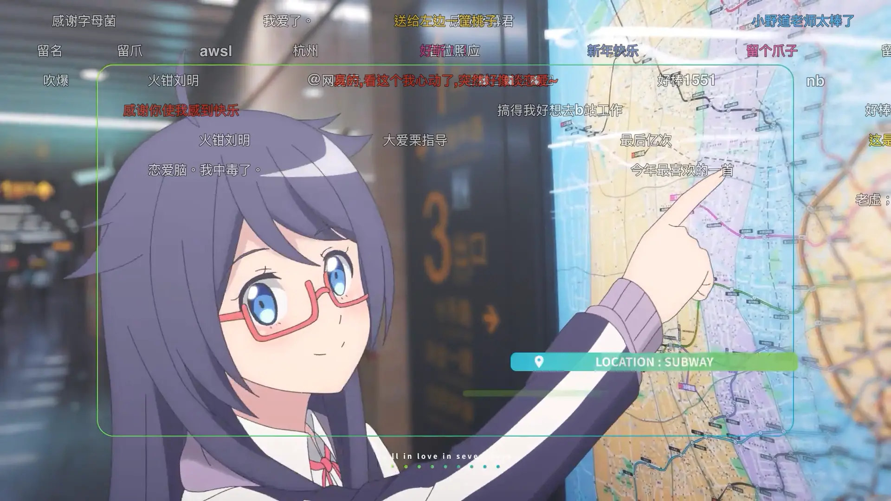

根据群友的推理，大概在 13 号线淮海中路站。

> [百度地图](https://map.baidu.com/poi/%E6%B7%AE%E6%B5%B7%E4%B8%AD%E8%B7%AF/@13522201.201210298,3639827.027602288,19.46z?uid=766754f347bb36a894031995&ugc_type=3&ugc_ver=1&device_ratio=1&compat=1&pcevaname=pc4.1&querytype=detailConInfo&da_src=shareurl)

---

匹配了最像的视角，但大概和原视频不是同一个视角，等实地探访。

> [百度地图全景](https://map.baidu.com/@13526595.2,3642001.47,21z,87t,56.32h#panoid=09000300121905211600484128P&panotype=street&heading=208.47&pitch=24.01&l=21&tn=B_NORMAL_MAP&sc=0&newmap=1&shareurl=1&pid=09000300121905211600484128P)

---

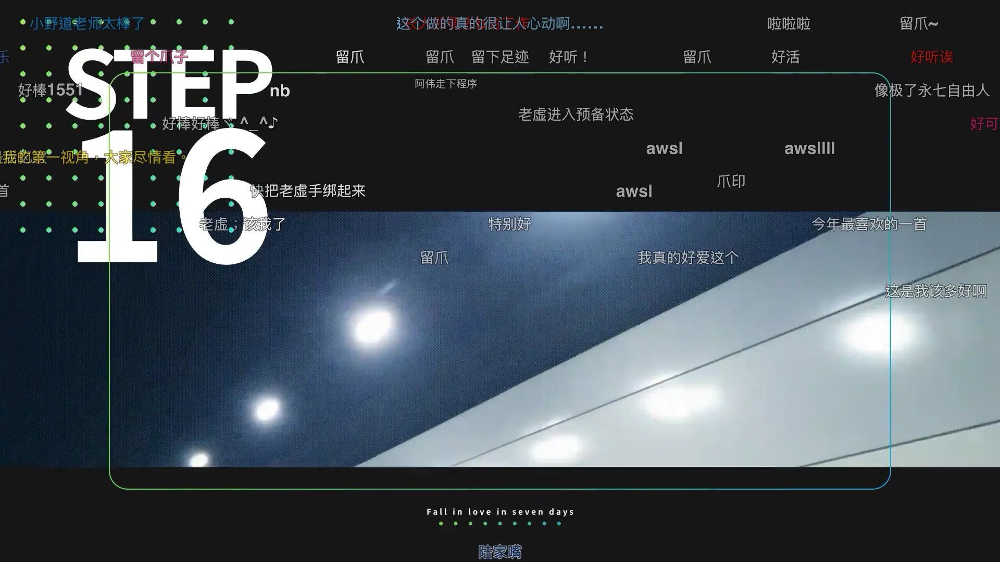

应该在延安东路隧道。

> [百度地图全景](https://map.baidu.com/search/%E5%BB%B6%E5%AE%89%E4%B8%9C%E8%B7%AF%E9%9A%A7%E9%81%93-%E9%81%93%E8%B7%AF/@13525816.65,3641996.9899999998,21z,87t,125.88h?querytype=s&da_src=shareurl&wd=%E5%BB%B6%E5%AE%89%E4%B8%9C%E8%B7%AF%E9%9A%A7%E9%81%93-%E9%81%93%E8%B7%AF&c=334&src=0&wd2=%E4%B8%8A%E6%B5%B7%E5%B8%82&pn=0&sug=1&l=12&b=(13395699.62,3554138.42;13490931.62,3602650.42)&from=webmap&biz_forward=%7B%22scaler%22:1,%22styles%22:%22pl%22%7D&sug_forward=79ab34056cf31073266e9862&device_ratio=1#panoid=09000300121905181435149048P&panotype=street&heading=263.04&pitch=14.52&l=21&tn=B_NORMAL_MAP&sc=0&newmap=1&shareurl=1&pid=09000300121905181435149048P)

---

 

> [百度地图全景](https://map.baidu.com/@13526928.51,3642864.75,21z,87t,80.43h#panoid=0900030012200821102433633Q3&panotype=street&heading=349.67&pitch=-1.2&l=21&tn=B_NORMAL_MAP&sc=0&newmap=1&shareurl=1&pid=0900030012200821102433633Q3)

---

大悦城的摩天轮？

> [百度地图](https://map.baidu.com/poi/%E6%91%A9%E5%A4%A9%E8%BD%AE(%E4%B8%8A%E6%B5%B7%E5%A4%A7%E6%82%A6%E5%9F%8E%E5%8C%97%E5%BA%A7%E5%BA%97)/@13523059.241655115,3642967.0286787865,19.31z?uid=b1799fe6a75cf51df8dc8577&ugc_type=3&ugc_ver=1&device_ratio=1&compat=1&pcevaname=pc4.1&querytype=detailConInfo&da_src=shareurl)

---

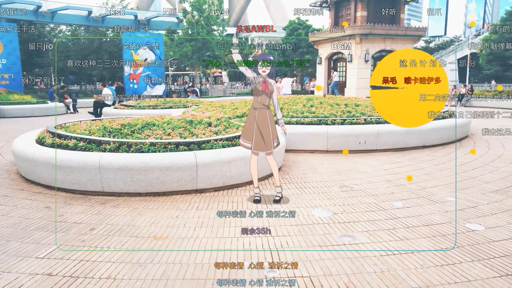

不用多说是迪士尼（

> [百度地图](https://map.baidu.com/poi/%E4%B8%8A%E6%B5%B7%E8%BF%AA%E5%A3%AB%E5%B0%BC%E5%BA%A6%E5%81%87%E5%8C%BA/@13544220.950556882,3629608.527175276,16.12z?uid=81ad5716b2c9c7fbe8e58272&ugc_type=3&ugc_ver=1&device_ratio=1&compat=1&pcevaname=pc4.1&querytype=detailConInfo&da_src=shareurl)

---

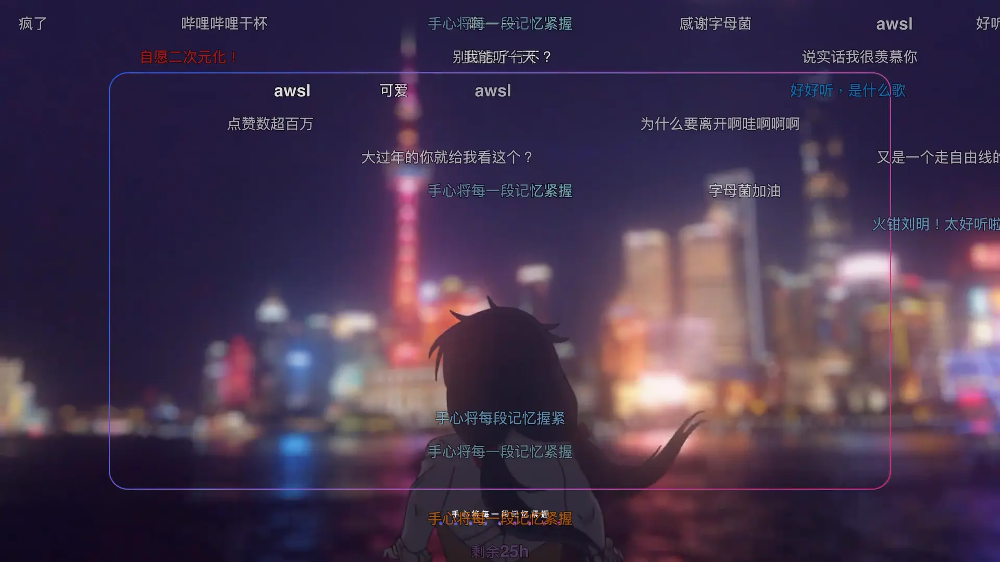

啊这也很熟悉了，想必大家都去过。

> [百度地图](https://map.baidu.com/poi/%E5%A4%96%E6%BB%A9/@13525154.526114598,3642110.9258691347,17.78z?uid=5c2dc21dd3dcd2056ec02cab&ugc_type=3&ugc_ver=1&device_ratio=1&compat=1&pcevaname=pc4.1&querytype=detailConInfo&da_src=shareurl)

---

有字就很明显啦！

> [百度地图](https://map.baidu.com/poi/GALA%20MALL/@13527421.71574517,3642537.5986702954,19.42z?uid=62d6f7cad9bfa85bca09f0ed&ugc_type=3&ugc_ver=1&device_ratio=1&compat=1&pcevaname=pc4.1&querytype=detailConInfo&da_src=shareurl) [百度地图全景](https://map.baidu.com/poi/GALA%20MALL/@13527425.37,3642588.8,21z,87t,-83.01h?uid=62d6f7cad9bfa85bca09f0ed&ugc_type=3&ugc_ver=1&device_ratio=1&compat=1&pcevaname=pc4.1&querytype=detailConInfo&da_src=shareurl#panoid=09000300121905221707430558P&panotype=street&heading=95.11&pitch=18.08&l=21&tn=B_NORMAL_MAP&sc=0&newmap=1&shareurl=1&pid=09000300121905221707430558P)

---

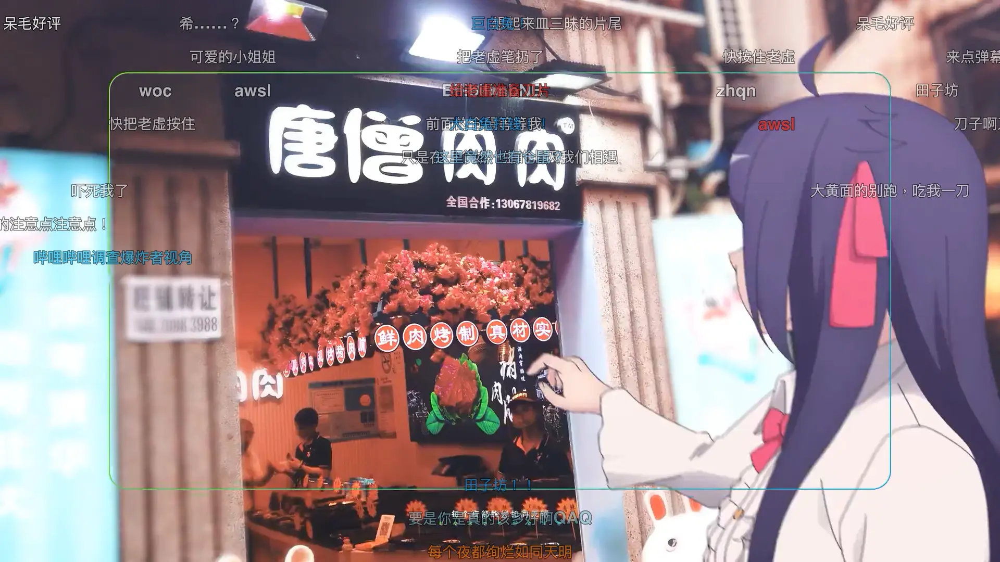

应该是这家。

> [百度地图](https://map.baidu.com/poi/%E5%94%90%E5%83%A7%E8%82%89%E8%82%89/@13522631.627719177,3638225.025606581,21z?uid=9510bae5255d31622bd7abf0&from=fav&ugc_type=3&ugc_ver=1&device_ratio=1&compat=1&pcevaname=pc4.1&querytype=detailConInfo&da_src=shareurl)

---

地点变换很快，两个地点相隔很远（

> [百度地图](https://map.baidu.com/poi/%E7%AD%BE%E5%8D%83%E4%B9%8B%E7%BA%A6%E7%99%BE%E5%91%B3%E4%B8%B2%E4%B8%B2(%E5%A4%96%E6%BB%A9%E5%9C%B0%E4%B8%8B%E7%BE%8E%E9%A3%9F%E8%A1%97%E5%BA%97)/@13524925.196480876,3642158.5441545467,20.53z?uid=47ef20853b583e95f8f0cbd2&ugc_type=3&ugc_ver=1&device_ratio=1&compat=1&pcevaname=pc4.1&querytype=detailConInfo&da_src=shareurl)

---

南京东路是步行街，所以没全景。

> [百度地图](https://map.baidu.com/poi/%E7%8E%8B%E5%BC%80%E6%91%84%E5%BD%B1(%E5%8D%97%E4%BA%AC%E4%B8%9C%E8%B7%AF%E5%BA%97)/@13524273.03,3641963.085,21z?uid=d85f62a74ca512cdf42310b9&ugc_type=3&ugc_ver=1&device_ratio=1&compat=1&pcevaname=pc4.1&querytype=detailConInfo&da_src=shareurl)

---

圣三一堂门前。

> [百度地图](https://map.baidu.com/poi/%E5%9C%A3%E4%B8%89%E4%B8%80%E5%A0%82/@13524661.103723288,3641921.368455607,20.3z?uid=4639bd4e9955dedf8b36ee9f&ugc_type=3&ugc_ver=1&device_ratio=1&compat=1&pcevaname=pc4.1&querytype=detailConInfo&da_src=shareurl) [百度地图全景](https://map.baidu.com/poi/%E5%9C%A3%E4%B8%89%E4%B8%80%E5%A0%82/@13524619.06,3641923.04,21z,87t,-76.62h?uid=4639bd4e9955dedf8b36ee9f&ugc_type=3&ugc_ver=1&device_ratio=1&compat=1&pcevaname=pc4.1&querytype=detailConInfo&da_src=shareurl#panoid=09000300121905181406289117I&panotype=street&heading=261.98&pitch=29.79&l=21&tn=B_NORMAL_MAP&sc=0&newmap=1&shareurl=1&pid=09000300121905181406289117I)

---

完结撒花（
