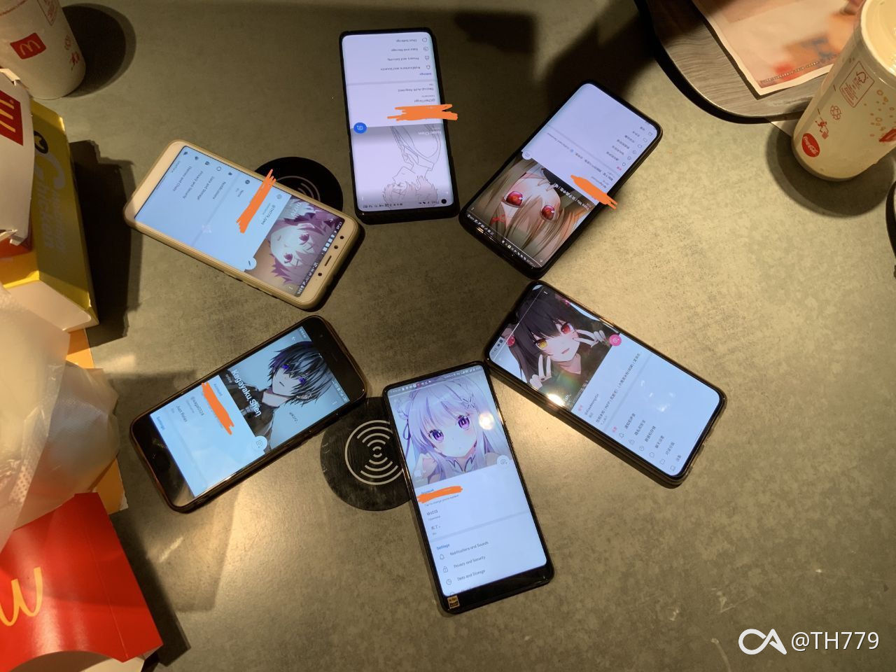
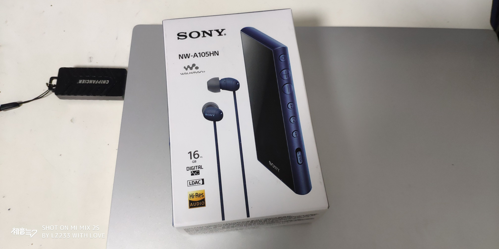
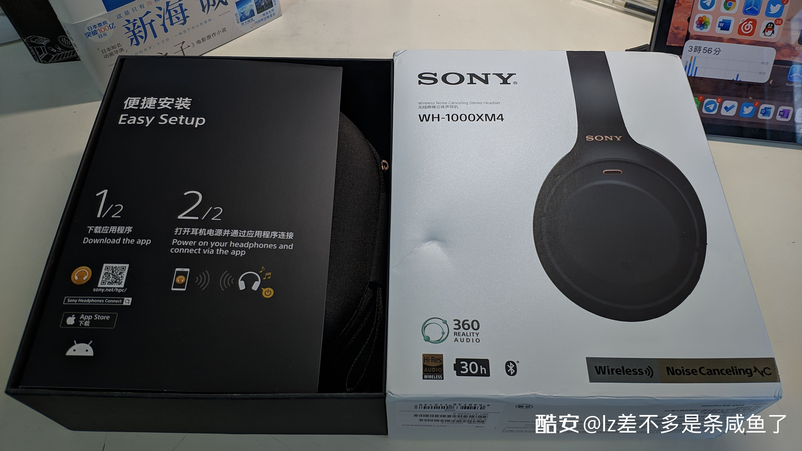
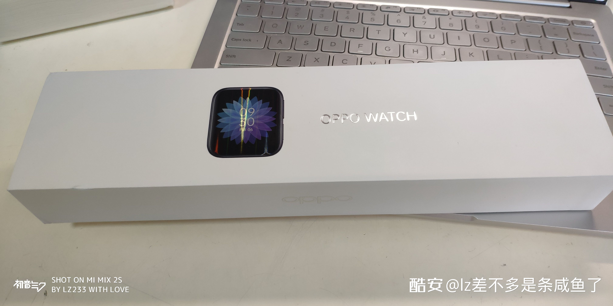
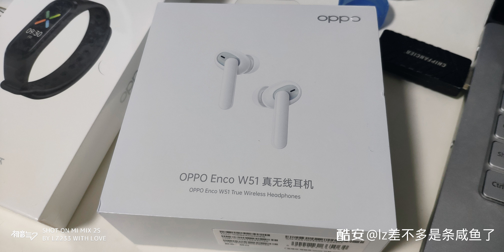
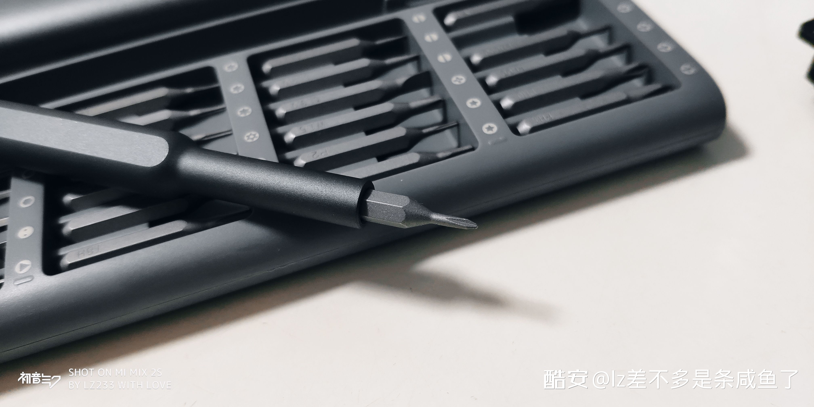
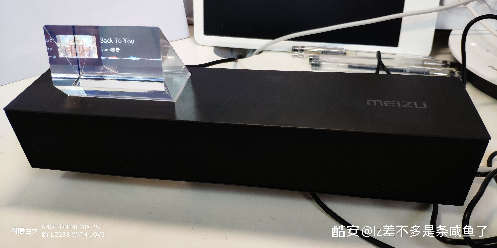

一年，十二个月，时间总是过得很快。从今年开始，我会尝试完成一篇属于自己的年终总结。虽然诸如此类的内容大概充满了无趣，但我仍想实现一下类似「每年都坚持下去」之类的想法。
今年的年终总结由几个关键词展开，这可能是一种老套的做法，但却能最适合不过地用来描述自己一年平淡枯燥的生活。
- 「友谊」
  暑假时，在上海做完手术的我在病房百般无聊，也正因如此，才勉强参加了 ChinaJoy，与结识多年的好友见了面。本带着巨大的心理负担，可见了面之后才知，一切都不是那么的必要，做自己，就好。
  
  话说回来，虽自认为自己并不是一个擅长交际的人，但却能随着时间的流逝慢慢结识到一些志同道合的「有趣灵魂」。这些人之中，有些是现实中的朋友，有些则不是；有些渐渐成了无话不谈的挚友，有些则局限于「点头之交」。
  度过和朋友在一起的时光，大概是生命中一件很有意思的事。如果可以，我不想和你们分开。

- 「学业」
  还记得初入高中时给自己许下的宣言吗？如今看来，这些或许是不切实际，亦或是在为自己的懒惰找借口。不管怎样，事情貌似也没有偏离原先的「电车轨道」。
  疫情对学业上的打击是致命的，以至于刚返校的我充满了不安与不自信。好在，我克服下来了。
  学考可能是这一年最重要的考试。虽距离自己的目标有所差距，但也还是可以接受。能体验到这个过程，或许就已经让咱满足。
  本学期已经过一半，下月就是高中历程中的第二次学考。在这，为自己祝福一下，可能会有点用？

- 「新『玩具』」
  今年的鱼鱼又对什么感兴趣呢？
  寒假，闲来无事地来到上海，入手了 NW-A105HN。
  
  WH-1000XM4 发布后，首发入了。
  
  参加了 OPPO Watch 应用开发大赛，收到了 OPPO Echo W51、OPPO Band 与 OPPO Watch 46mm。
  
  
  入了米家的电动螺丝刀，手感和工艺都尚且满意。不过，这似乎更像是「工艺品」，对于「工具」。
  
  除此之外，还入手了 Meizu Gravity 来折腾。这可能是魅族一款独一无二的「作品」，可惜依旧没能与现实抗衡。
  

- 「技能点」
  作为一个~~不称职~~开发者，在一年当中也还是能学会一些东西的。比如 Kotlin 和 iOS 入门，可能就是今年最大的收获。
  依旧在维护「一言」这个项目，尽管我承认先前的代码很糟。现在主要的精力还是放在代码规范化与 Kotlin 化的方向上，不过，以后可能也没这么多时间维护啦。
  还完成了「Meizu Gravity +」与「Meizu Gravity Controller」的编写，算是满足自己对 Meizu Gravity 的一点期待。
  诸如此类，糊出了一系列奇奇怪怪，能满足自己好奇心或需求的「小玩具」。在这之中，少不了大家的支持。因此，我看到了一些自己存在的价值。
  总之，路还很长，我也还是什么都不会。若能在满足自己需求的同时方便他人，那就更好了。

- 「未来」
这一年中，其实还有很多事情没来得及完成，也还有很多遗憾被留下。
时间是不会让你停下脚步的，而我们只能在不断流逝的时间中尽自己所能地保持节奏。
2020 年，我学会了如何接受，也在努力变得更加外向乐观，尝试将自己原本的一面表现出来。
2021 年的第一个挑战很快就来了，希望自己可以旗开得胜。毕竟，好的开头也许能让自己的一整年都有好心情？

人生太短，时间太快。抓紧时间做自己喜欢的事，陪自己喜欢的人，去更远的地方看看，大概才能被称之为「人生」。